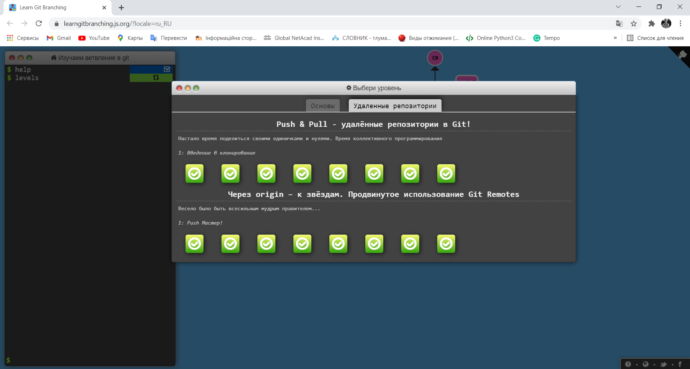
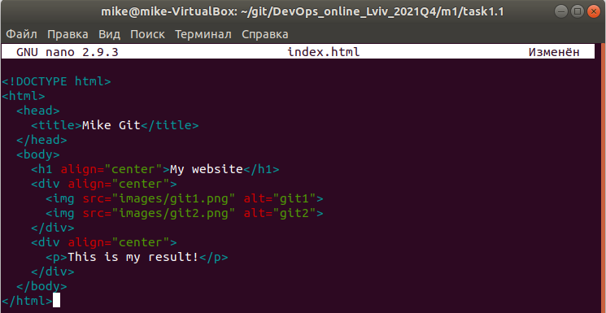

# Task1.1
### Prologue
To show the process and result of my work, I will attach screenshots to each important point. If the point is easy or screenshots are enough, I can omit the explanation.
### Demonstration of my work with Git
Before the main task, I complete all labs on https://learngitbranching.js.org/?locale=ru_RU.

<b>1</b>

<b>2</b>

<b>3</b>

<b>4</b>

<b>setting up an SSH connection</b>

<b>5-6</b>

<b>create a repository structure</b>

<b>7-10</b>

<b>11</b>

<b>12</b>

<b>13</b>

<b>14</b>

<b>15-16</b>

<b>17</b>

<b>18-19</b>

<b>20-21</b>

<b>22</b>

<b>23</b>

<b>24-25</b>

### Epilogue
I had one merge conflict in this task. The conflict appeared because my "index.html" files in "develop" and "styles" branches were different. To solve this conflict, I aborted the merge with the command "git merge --abort", and then modified "index.html" files in both branches. So both these files became identical, and I made the merge again without any problem. The solution to this problem can see in the screenshots under the number "19".

### About DevOps
According to my way of thinking, DevOps is a conception that helps developers and operators work more efficiently together. It is a bridge between dissimilar spheres and an essential part of every project. This conception improves the development process and continuously resolves different troubles. DevOps engineers are people who provide this culture.
