# Task 2.1
## Part 1. Hypervisors

The most popular hypervisors type 1:
1. VMware vSphere / ESXi.
2. Microsoft Hyper-V.
3. Xen / Citrix XenServer.
4. KVM.

The most popular hypervisors type 2:
1. Oracle VirtualBox.
2. VMware Workstation.
3. Microsoft Virtual PC.
4. VMware Fusion.

The main difference between hypervisors is their types. There are two main hypervisor types, referred to as “Type 1” (or “bare metal”) and “Type 2” (or “hosted”). A type 1 hypervisor acts like a lightweight operating system and runs directly on the host’s hardware, while a type 2 hypervisor runs as a software layer on an operating system, like other computer programs.

Let's take a look at the descriptions of some of them:
* Microsoft Hyper-V (type 1) is the virtualization software which is provided with Microsoft Windows Server. Deploying Hyper-V is easy because it comes with the operating system. Another advantage of Hyper-V is that it can be used with the wide range of hardware which supports Windows Server.
* KVM (Kernel-based Virtual Machine)(type 1) is an open source virtualization technology built into Linux. Specifically, KVM lets you turn Linux into a hypervisor that allows a host machine to run multiple, isolated virtual environments called guests or virtual machines.
* Oracle VitualBox (type 2) is a free and open-source hosted hypervisor for x86 virtualization, developed by Oracle Corporation. VirtualBox may be installed on Windows, macOS, Linux, Solaris and OpenSolaris. There are also ports to FreeBSD and Genode.
* VMware Workstation (type 2) is a line of hosted hypervisor products running on x64 computers that allows users to run virtual machines, containers, and Kubernetes clusters on a single physical machine and use them simultaneously along with the host machine. Each virtual machine can execute its own operating system, including versions of Windows, Linux, BSD, and MS-DOS.

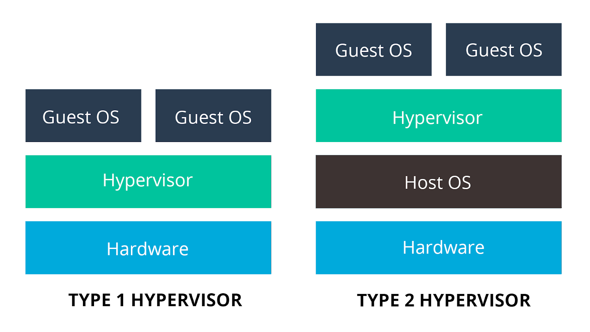

## Part 2. Work with VirtualBox

In my opinion, VirtualBox is a very user-friendly soft. There you can use both the console and the interface. So I will use both options to demonstrate this possibility.

<b>1.1-1.4</b>

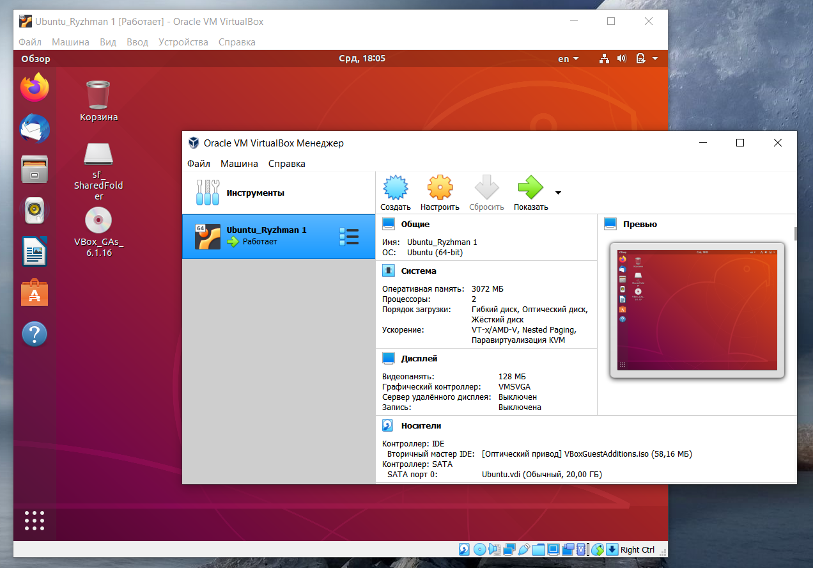

<b>1.5</b>

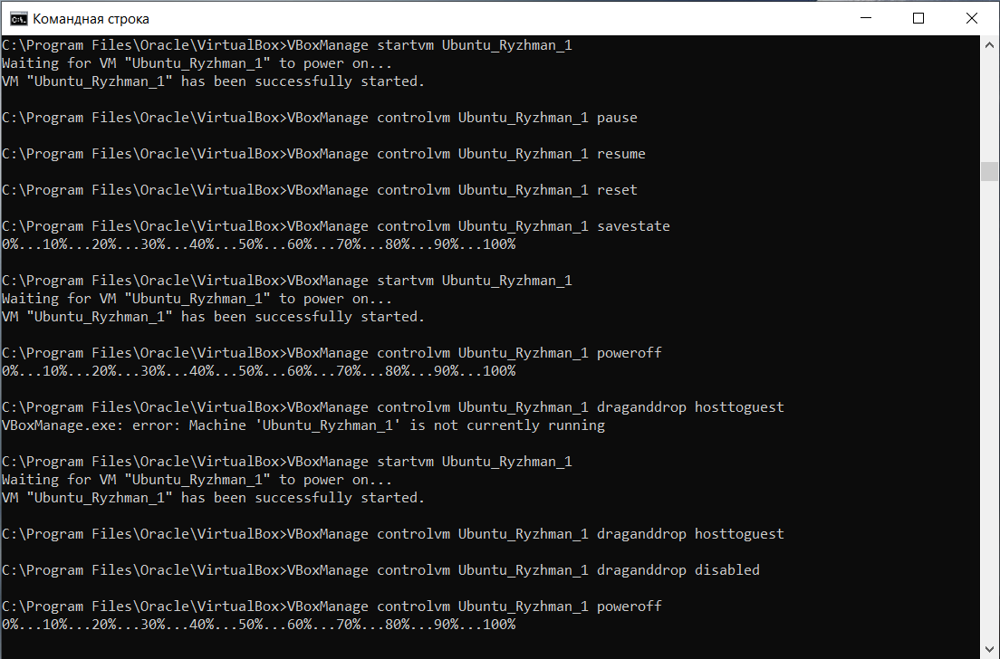

<b>1.6-1.7</b>

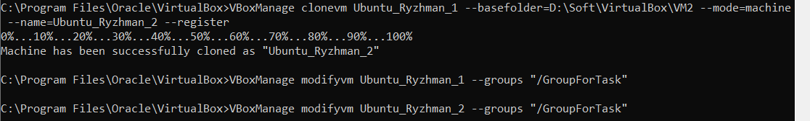

<b>1.8</b>

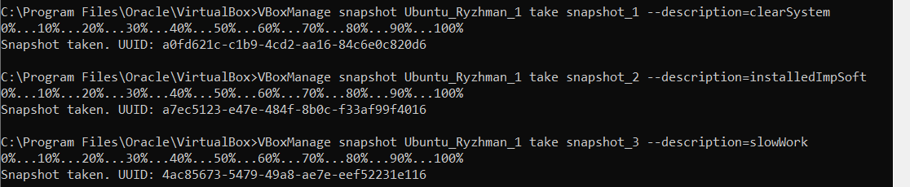

<b>1.9</b>

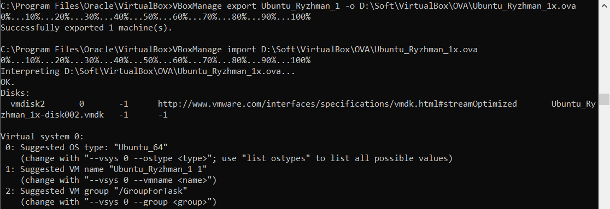

<b>2.1-2.3</b>

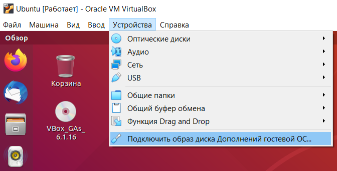

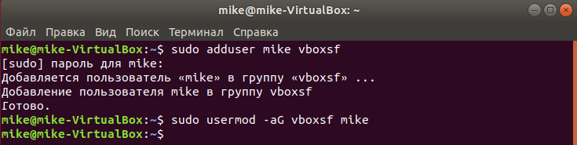

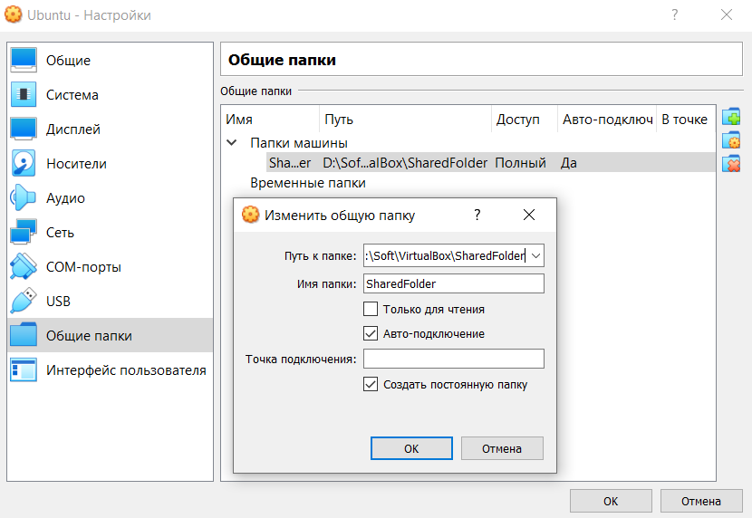

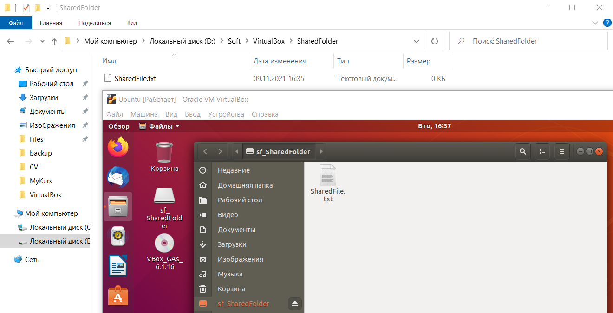

<b>2.4</b>

The default connection type was NAT, so the ping command was only executed in one direction (guest -> host). I set the connection type to bridged and successfully pinged the guest from the host.

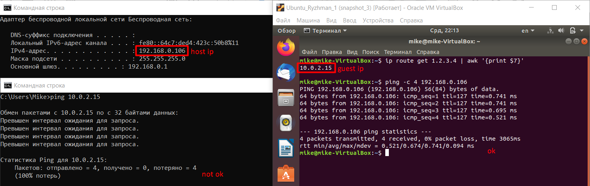

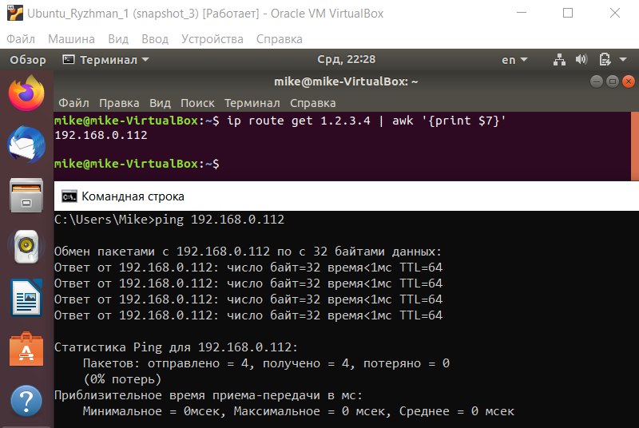

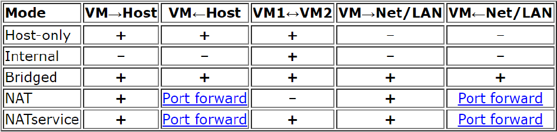

## Part 3. Work with Vagrant

<b>1-3</b>

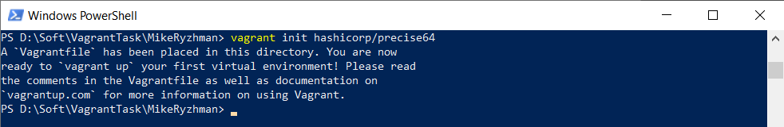

<b>4</b>

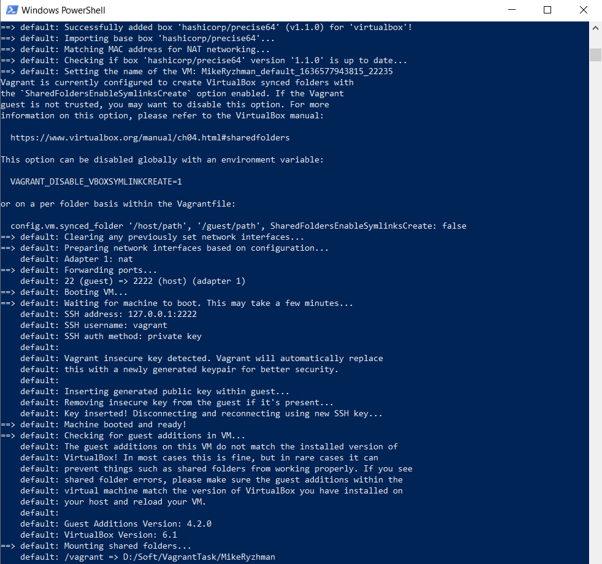

<b>5-6</b>

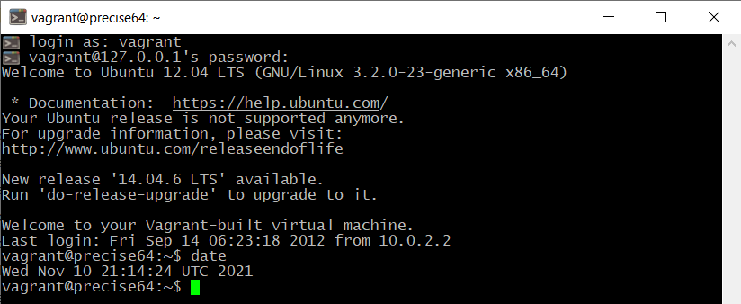

<b>7</b>

<b>8</b>

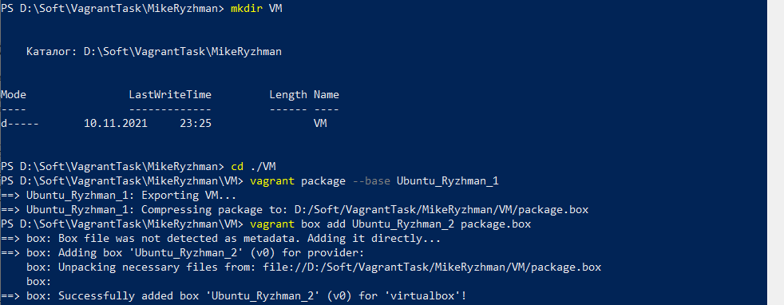

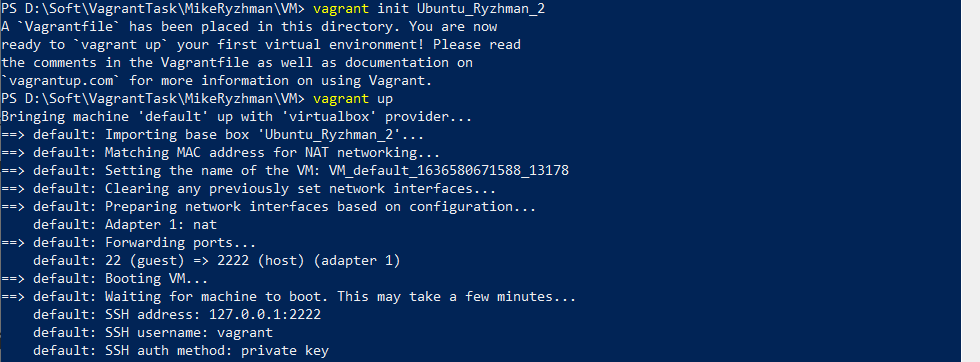
