# Task 2.2

<b>1-4</b>

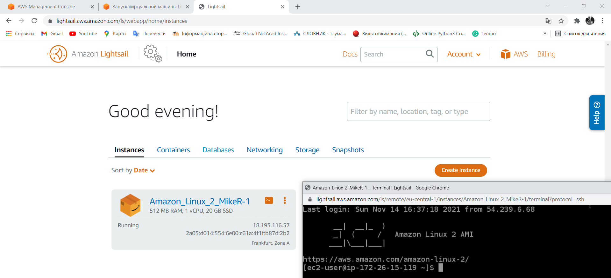

<b>5</b>

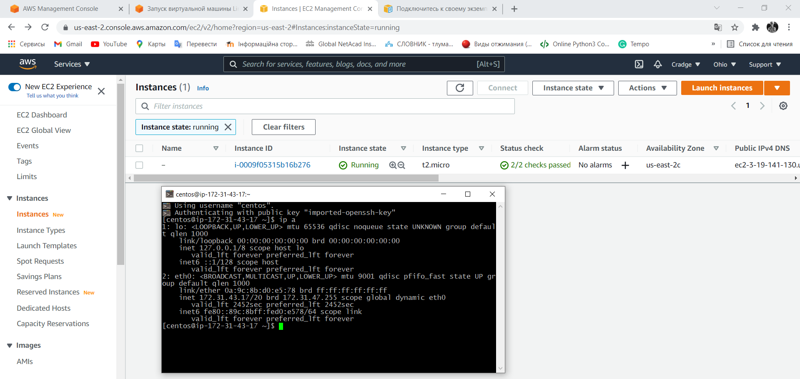

<b>6</b>

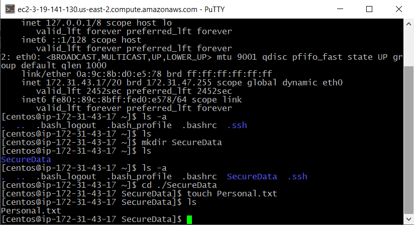

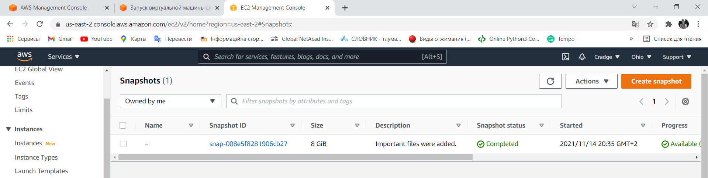

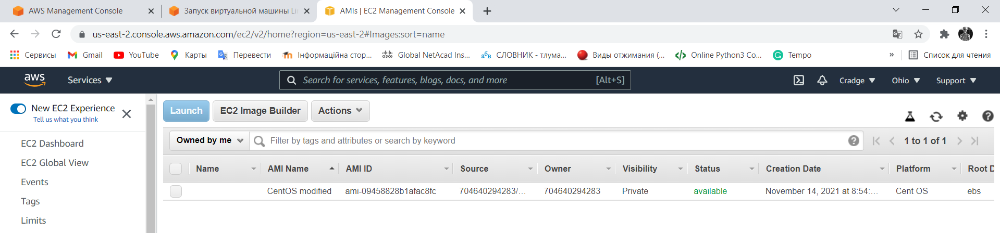

<b>7</b>

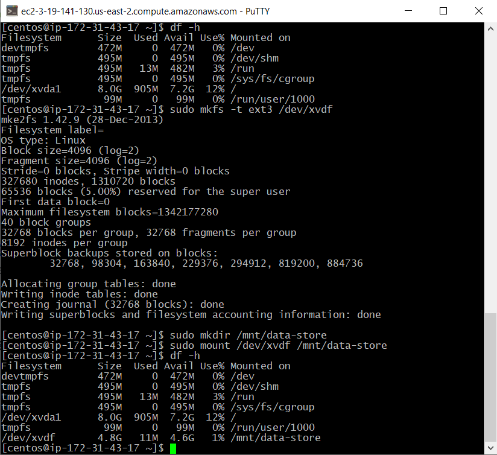

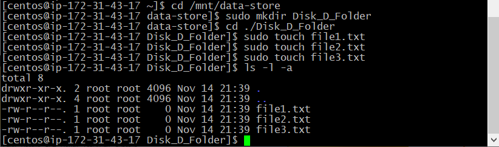

<b>8</b>

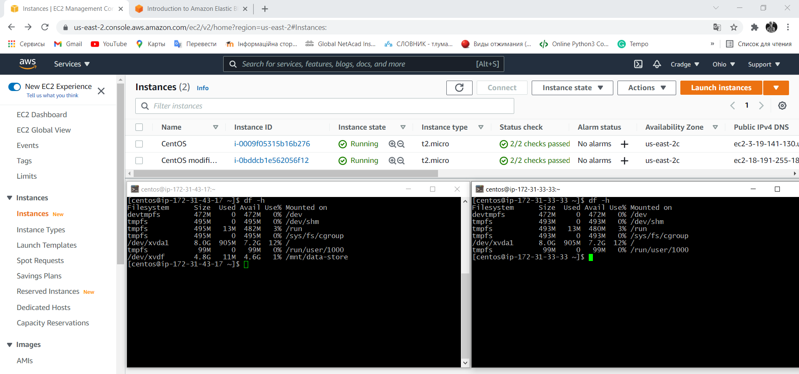

<b>9</b>

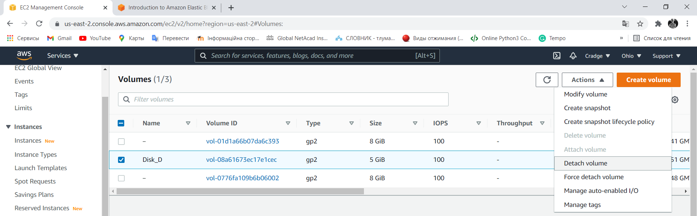

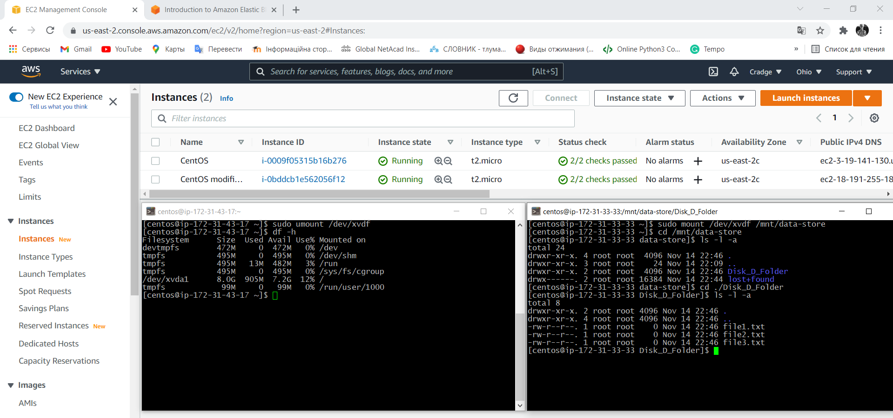

<b>10</b>

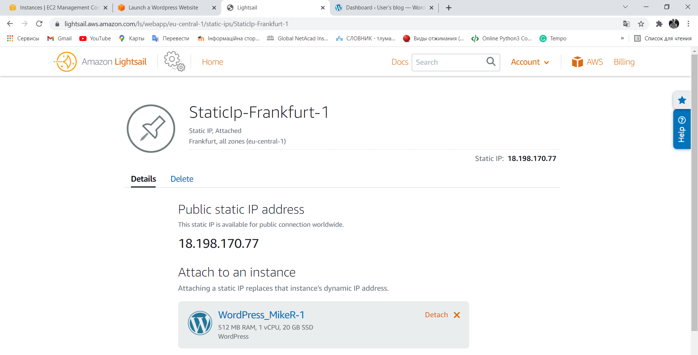

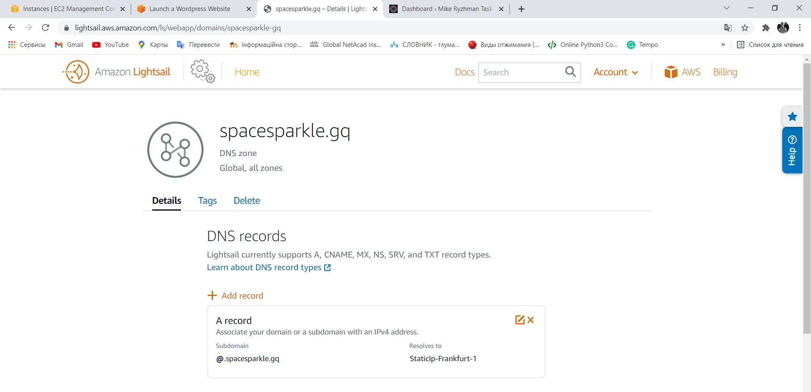

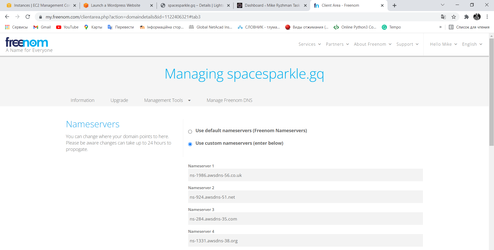

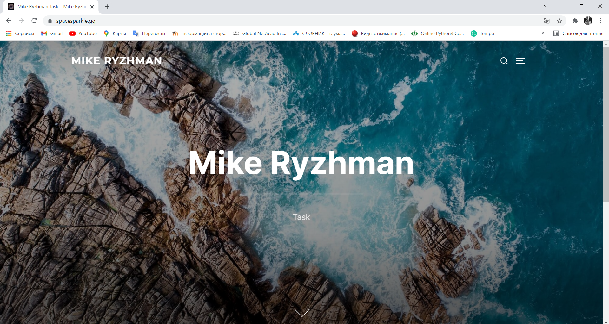

<b>11</b>

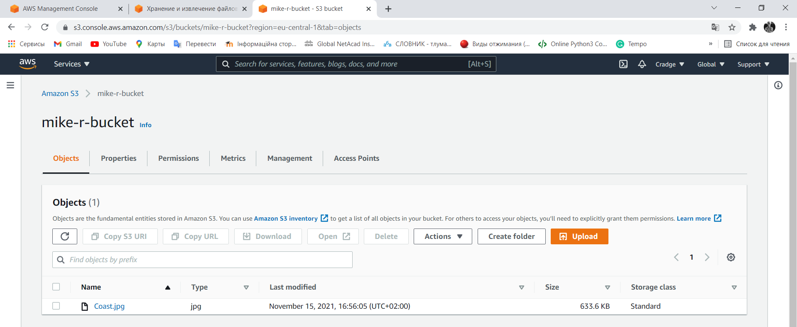

<b>12</b>

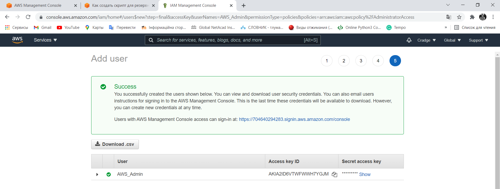

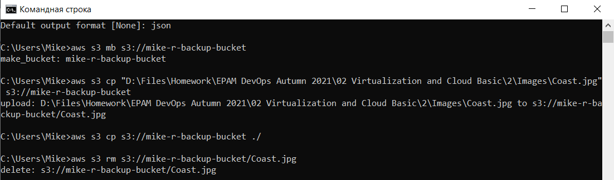

<b>14</b>

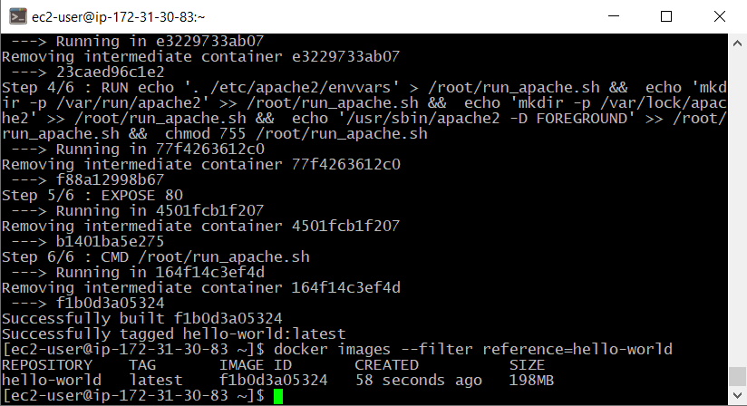

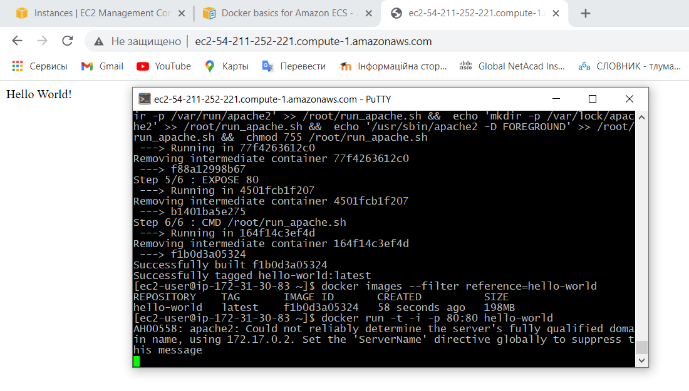

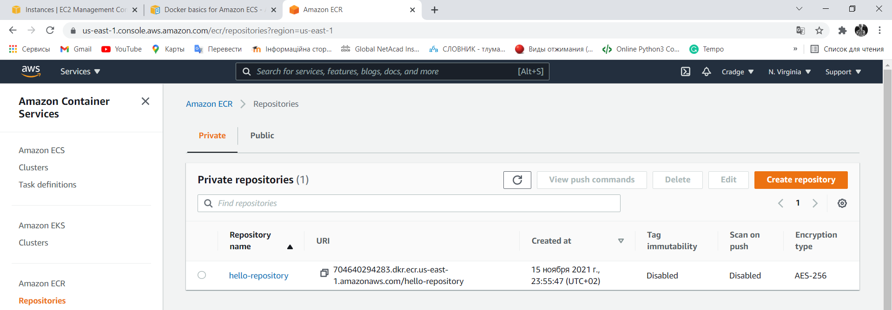

<b>15</b>

In this task I created a static website on Amazon S3: [spacesparkle.gq](http://spacesparkle.gq/). I get this domain on [freenom](https://www.freenom.com/ru/index.html) without spending any money, so if this link doesn't work, please try this [one](http://mike-r-website.s3-website.eu-central-1.amazonaws.com/) (http://mike-r-website.s3-website.eu-central-1.amazonaws.com/).
