This is the link to the [final project](https://github.com/Cradge/DevOps_online_Lviv_2021Q4/blob/master/m3/task4_extra.pkt).

# Task 3.1

* This is the link to [task1.pkt](https://github.com/Cradge/DevOps_online_Lviv_2021Q4/blob/master/m3/task1.pkt).

<b>Network</b>

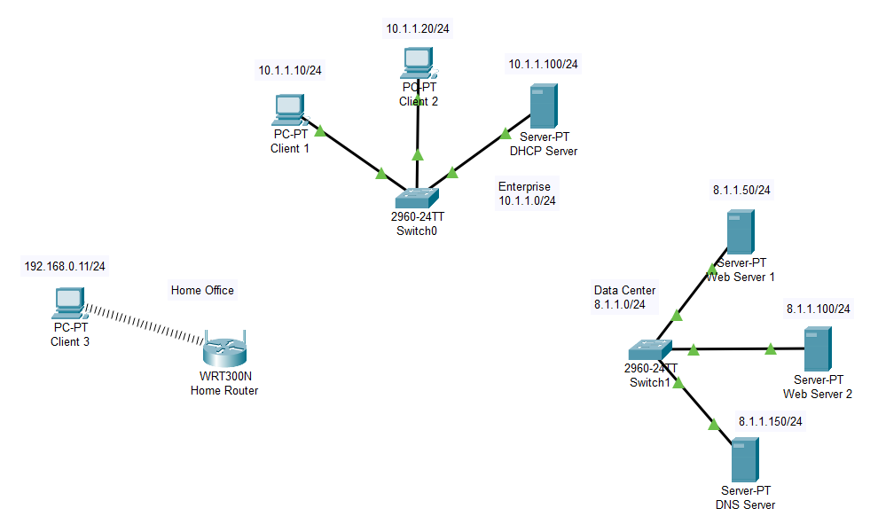

<b>1-3</b>

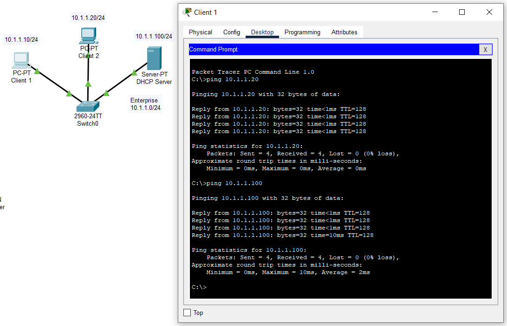

<b>4-5</b>

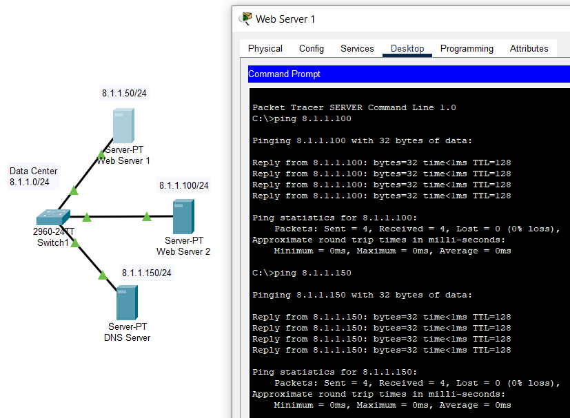

<b>6-8</b>

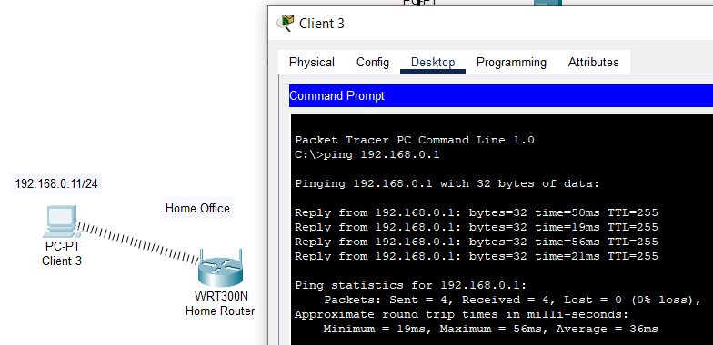

<b>Additional Task</b>

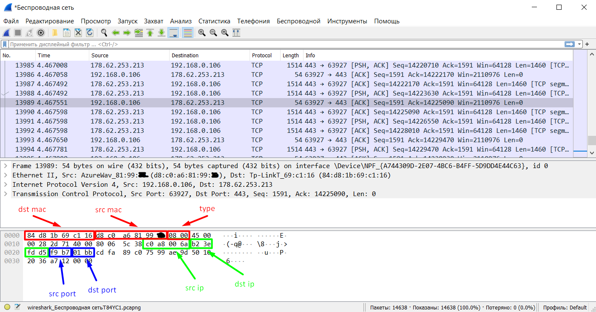

Information from screenshot:
* src mac: d8:c0:a6:81:99:XX
* dst mac: 84:d8:1b:69:c1:16
* src ip: 192.168.0.106
* dst ip: 178.62.253.213
* src port: 63927
* dst port: 443

# Task 3.2

* This is the link to [task2.pkt](https://github.com/Cradge/DevOps_online_Lviv_2021Q4/blob/master/m3/task2.pkt).
* This is the link to [task2_extra.pkt](https://github.com/Cradge/DevOps_online_Lviv_2021Q4/blob/master/m3/task2_extra.pkt).

<b>Network</b>

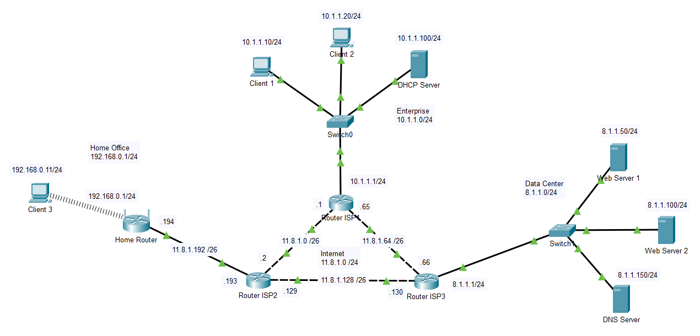

<b>1-5</b>

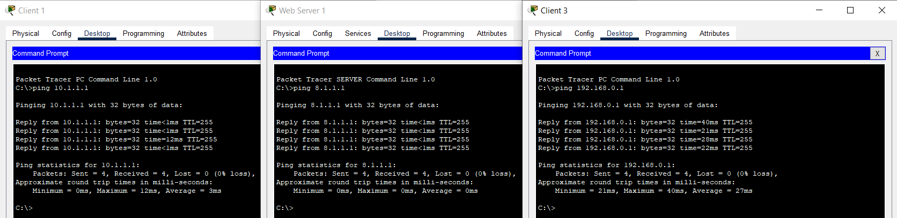

<b>6-8</b>

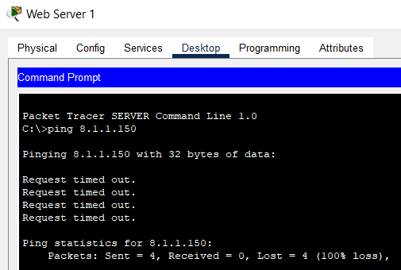

After I changed subnet masks from /24 to /26 on all servers in Data Center, packets from Web Server 1 to DNS Server started to be lost. It was because the total number of hosts in /26 is 64. At that point, servers were situated in different subnets, but Switch and Router didn`t know about it.

<b>9-11</b>

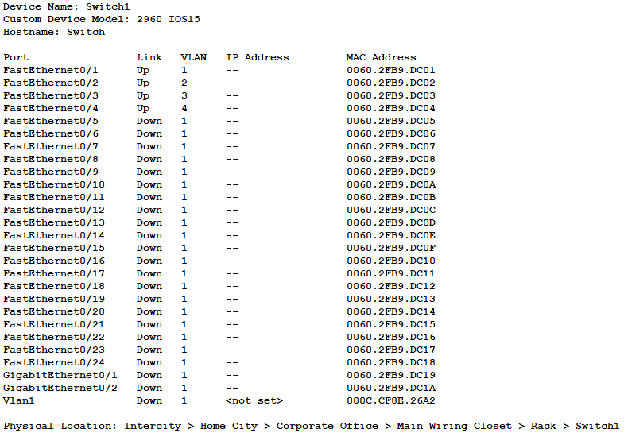

I have distributed servers in different VLANs.

<b>Additional Task</b>

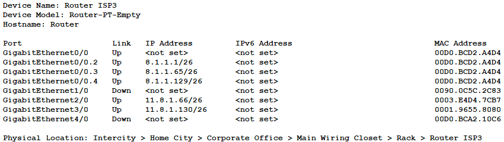

Now everything works fine. I have split one network into three using only one Router.

# Task 3.3

* This is the link to [task3.pkt](https://github.com/Cradge/DevOps_online_Lviv_2021Q4/blob/master/m3/task3.pkt).
* This is the link to [task3_extra.pkt](https://github.com/Cradge/DevOps_online_Lviv_2021Q4/blob/master/m3/task3_extra.pkt).

<b>1-3</b>

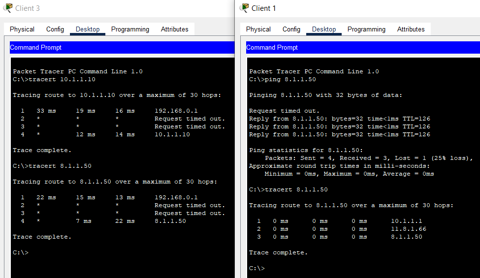

<b>Additional Task</b>

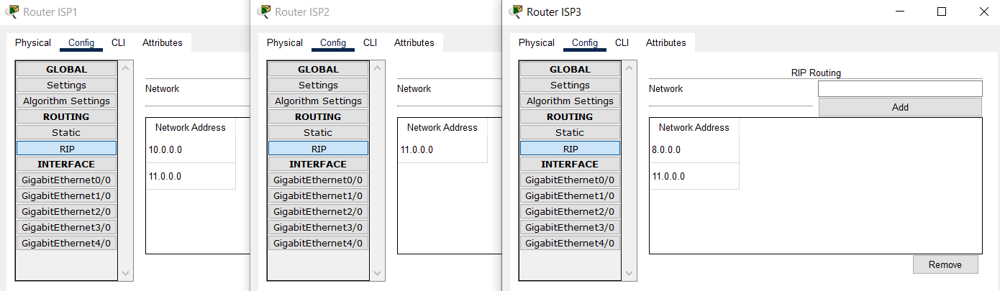

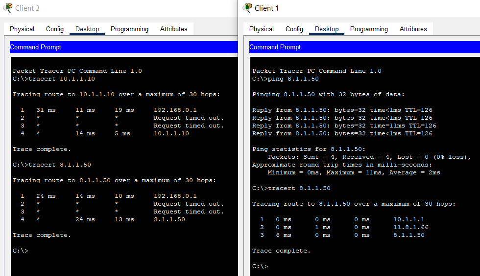

# Task 3.4

* This is the link to [task4.pkt](https://github.com/Cradge/DevOps_online_Lviv_2021Q4/blob/master/m3/task4.pkt).
* This is the link to [task4_extra.pkt](https://github.com/Cradge/DevOps_online_Lviv_2021Q4/blob/master/m3/task4_extra.pkt).

<b>Network</b>

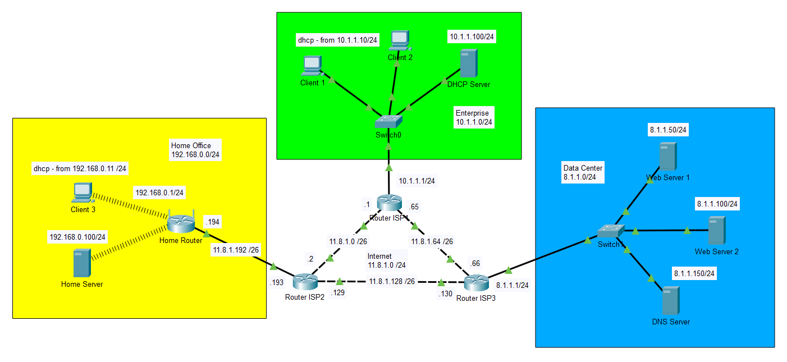

<b>1-4</b>

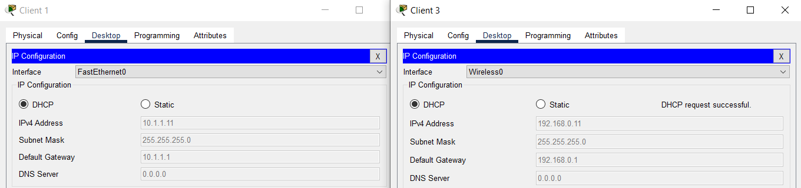

<b>5-8</b>

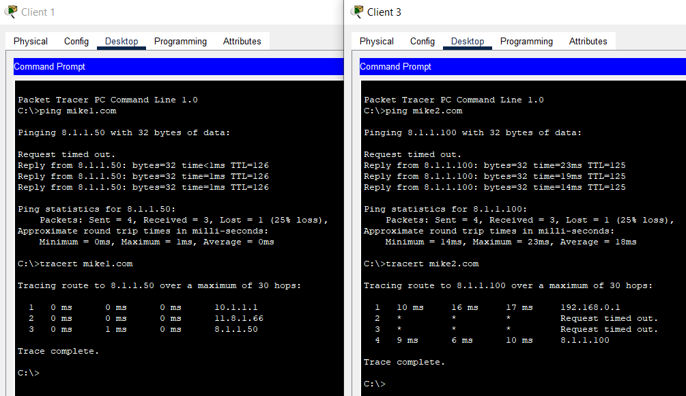

<b>Additional Task</b>

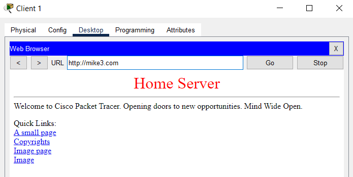

# Extra

Last year I had coursework in information and communication systems. In that task, I have made one big corporate network with Cisco Packet Tracer. Here I attached the [.pkt file](https://github.com/Cradge/DevOps_online_Lviv_2021Q4/blob/master/m3/kurs/kurs.pkt) and short [presentation](https://github.com/Cradge/DevOps_online_Lviv_2021Q4/blob/master/m3/kurs/Kurs_IKS_Ryzhman.pdf) with my work.
