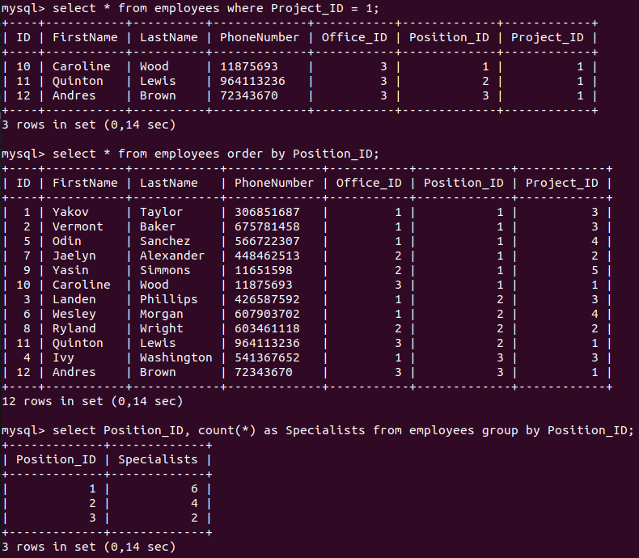

# Task 4.1
## Part 1

<p align="center"><b>1-2</b></p>

```
sudo apt install mysql-server
sudo mysql_secure_installation
systemctl status mysql.service

sudo apt install ./mysql-workbench-community_8.0.27-1ubuntu20.04_amd64.deb
```


<p align="center"><b>3</b></p>

I created a simple database that contains information about employees. The main table is "employees". It is contains "ID", "FirstName", "LastName", "PhoneNumber", "Office_ID", "Position_ID", "Project_ID". Other tables are "offices", "positions", "projects", "importance". I tried to normalize my database to 3NF (Third Normal Form), so there are some relations between tables:
+ Table "offices" to "Office_ID" in "employee"
+ Table "positions" to "Position_ID" in "employee"
+ Table "projects" to "Project_ID" in "employee"
+ Table "importance" to "Importance_ID" in "projects"


<p align="center"><b>4</b></p>

```
sudo mysql
ALTER USER 'root'@'localhost' IDENTIFIED WITH caching_sha2_password BY 'kdgwX810';
FLUSH PRIVILEGES;
SELECT user,authentication_string,plugin,host FROM mysql.user;

sudo ufw allow from 127.0.0.1 to 127.0.0.1 port 3306 proto tcp

mysql -u root -p
create database employees;
show databases;
use employees;
```


<p align="center"><b>5</b></p>

```
create table importance (ID INT Primary Key, ImportanceLevel varchar(50));
create table projects (ID INT Primary Key, ProjectName varchar(50), Importance_ID INT, FOREIGN KEY (Importance_ID)  REFERENCES importance (ID));
create table positions (ID INT Primary Key, PositionName varchar(50), Salary INT);
create table offices (ID INT Primary Key, OfficeName varchar(50));
create table employees (ID INT Primary Key, FirstName varchar(50), LastName varchar(50), PhoneNumber varchar(50), Office_ID INT, Position_ID INT, Project_ID INT, FOREIGN KEY (Office_ID)  REFERENCES offices (ID), FOREIGN KEY (Position_ID)  REFERENCES positions (ID), FOREIGN KEY (Project_ID)  REFERENCES projects (ID));

insert into importance (ID, ImportanceLevel) values ('1', 'Low'), ('2', 'Medium'), ('3', 'High');
insert into projects (ID, ProjectName, Importance_ID) values ('1', 'Snake Game', '2'), ('2', 'Calculator', '3'), ('3', 'Photo Editor', '3'), ('4', 'Notebook Pro', '2'), ('5', 'Calendar', '1');
insert into positions (ID, PositionName, Salary) values ('1', 'Developer', '50000'), ('2', 'Tester', '40000'), ('3', 'DevOps', '70000');
insert into offices (ID, OfficeName) values ('1', 'Downtown CreateIT Center'), ('2', 'Westside CreateIT Center'), ('3', 'Eastside CreateIT Center');
insert into employees (ID, FirstName, LastName, PhoneNumber, Office_ID, Position_ID, Project_ID) values ('1', 'Yakov', 'Taylor', '306851687', '1', '1', '3'), ('2', 'Vermont', 'Baker', '675781458', '1', '1', '3'), ('3', 'Landen', 'Phillips', '426587592', '1', '2', '3'), ('4', 'Ivy', 'Washington', '541367652', '1', '3', '3'), ('5', 'Odin', 'Sanchez', '566722307', '1', '1', '4'), ('6', 'Wesley', 'Morgan', '607903702', '1', '2', '4'), ('7', 'Jaelyn', 'Alexander', '448462513', '2', '1', '2'), ('8', 'Ryland', 'Wright', '603461118', '2', '2', '2'), ('9', 'Yasin', 'Simmons', '11651598', '2', '1', '5'), ('10', 'Caroline', 'Wood', '11875693', '3', '1', '1'), ('11', 'Quinton', 'Lewis', '964113236', '3', '2', '1'), ('12', 'Andres', 'Brown', '72343670', '3', '3', '1');
```


<p align="center"><b>6</b></p>

```
select * from projects;
select * from positions;
select * from projects where Importance_ID > 1;
select * from employees where Project_ID = 3;
select * from employees order by Project_ID;
select Project_ID, count(*) as Specialists from employees group by Project_ID;
```


<p align="center"><b>8</b></p>

```
CREATE USER 'gass'@'%' IDENTIFIED WITH mysql_native_password BY 'gsaescsret01';
GRANT SELECT ON *.* TO 'gass'@'%' WITH GRANT OPTION;

CREATE USER 'jass'@'%' IDENTIFIED WITH mysql_native_password BY 'jsaescsret01';
GRANT CREATE, ALTER, INSERT, SELECT ON *.* TO 'jass'@'%' WITH GRANT OPTION;

CREATE USER 'kass'@'%' IDENTIFIED WITH mysql_native_password BY 'ksaescsret01';
GRANT DROP, DELETE, SELECT ON *.* TO 'kass'@'%' WITH GRANT OPTION;

CREATE USER 'mike'@'localhost' IDENTIFIED BY 'msiekceret';
GRANT ALL PRIVILEGES ON *.* TO 'mike'@'localhost' WITH GRANT OPTION;
```


<p align="center"><b>7</b></p>

SQL Commands:
+ DDL: CREATE, ALTER, DROP, TRUNCATE, COMMENT, RENAME.
+ DML: SELECT, INSERT, UPDATE, DELETE, MERGE, CALL, EXPLAIN PLAN, LOCK TABLE.
+ DCL: GRANT, REVOKE.
+ TCL: COMMIT, ROLLBACK, SAVEPOINT, SET TRANSACTION.

```
use employees;
select * from projects;
create table mytable (ID INT Primary Key, MyTableName varchar(50));

use employees;
create table mytable (ID INT Primary Key, MyTableName varchar(50));
insert into mytable (ID, MyTableName) values ('1', 'One'), ('2', 'Two'), ('3', 'Three');
drop table mytable;

use employees;
create table mytable2 (ID INT Primary Key, MyTableName varchar(50));
select * from mytable;
drop table mytable;

use employees;
create table mytable (ID INT Primary Key, MyTableName varchar(50));
insert into mytable (ID, MyTableName) values ('1', 'One'), ('2', 'Two'), ('3', 'Three');
select * from mytable;
drop table mytable;
```

<p align="center"><b>gass (select)</b></p>


<p align="center"><b>jass (create, alter, insert, select)</b></p>


<p align="center"><b>kass (drop, delete, select)</b></p>


<p align="center"><b>mike (all privileges)</b></p>


<p align="center"><b>9</b></p>

```
use mysql;
show tables;
select * from plugin;
SELECT user,authentication_string,plugin,host FROM mysql.user;
```


## Part 2

<p align="center"><b>10</b></p>

```
pwd
mysqldump -u root -p employees > /media/sf_SharedFolder/employees_base.sql
ls
```


<p align="center"><b>11</b></p>

```
use employees;
show tables;
drop table employees;
show tables;
```


<p align="center"><b>12</b></p>

```
mysql -u root -p employees < /media/sf_SharedFolder/employees_base.sql

use employees;
show tables;
```


<p align="center"><b>13</b></p>

```
mysql -u admin -h mike-db.cwq0mr5h32kf.us-east-2.rds.amazonaws.com -p
show databases;
create database employees;
show databases;

mysql -u admin -h mike-db.cwq0mr5h32kf.us-east-2.rds.amazonaws.com -p employees < /media/sf_SharedFolder/employees_base.sql
mysql -u admin -h mike-db.cwq0mr5h32kf.us-east-2.rds.amazonaws.com -p
use employees;
show tables;
```


<p align="center"><b>14-15</b></p>

```
select * from employees where Project_ID = 1;
select * from employees order by Position_ID;
select Position_ID, count(*) as Specialists from employees group by Position_ID;
```



I made a selection from the main table using the "JOIN" operator to connect other tables. This example perfectly shows relations between tables in my database.

```
SELECT employees.LastName, offices.OfficeName, positions.PositionName, projects.ProjectName FROM employees JOIN offices ON employees.Office_ID = offices.ID JOIN positions ON employees.Position_ID = positions.ID JOIN projects ON employees.Project_ID = projects.ID ORDER BY employees.ID;
```


<p align="center"><b>16</b></p>

```
mysqldump -u admin -h mike-db.cwq0mr5h32kf.us-east-2.rds.amazonaws.com -p employees > /media/sf_SharedFolder/employees_base_RDS_mike-db.sql
```


## Part 3

<p align="center"><b>17</b></p>


<p align="center"><b>18</b></p>


<p align="center"><b>19</b></p>


