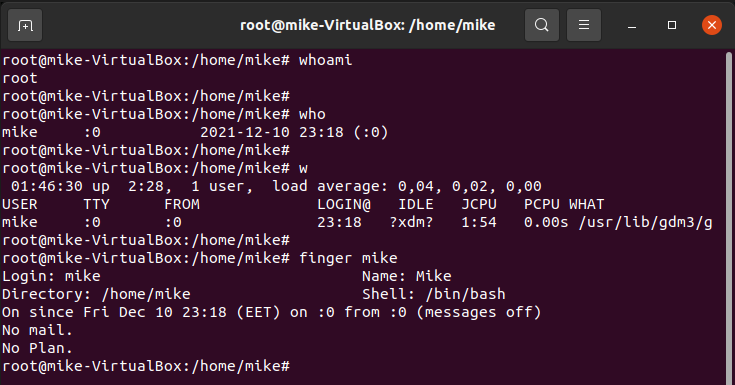
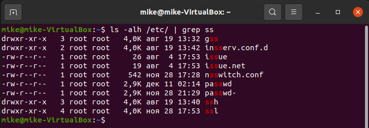

# Task 5.1
## Part 1

<p align="center"><b>1</b></p>

```
sudo su
```


+ The command "sudo" allows a permitted user to execute a command as the superuser or another user.
+ The command "su" allows running commands with a substitute user and group ID. When called without arguments, "su" defaults to running an interactive shell as root.


<p align="center"><b>2</b></p>

```
sudo su
passwd mike

nano /etc/passwd
nano /etc/shadow
nano /etc/pam.d/passwd
```


+ The "passwd" command changes passwords for user accounts. A normal user may only change the password for their own account, while the superuser may change the password for any account.

+ /etc/passwd - contains information about users.
+ /etc/shadow - contains protected information about users.
+ /etc/pam.d/passwd - PAM configuration for "passwd".


<p align="center"><b>3</b></p>

```
whoami
who
w
finger mike

less /etc/passwd
cut -d : -f 1 /etc/passwd
```




+ "whoami" - prints  the  user  name  associated  with the current effective user ID.
+ "who" - shows who is logged on.
+ "w" - shows who is logged on and what they are doing.
+ "finger" - displays information about the system users.
+ "cut" - removes sections from each line of files.
+ "less /etc/passwd" or "cut -d : -f 1 /etc/passwd" - shows users registered in the system.


<p align="center"><b>4</b></p>

```
chfn mike
```


+ The "chfn" command changes the user full name, office room number, office phone number, and home phone number information for a user's account.


<p align="center"><b>5</b></p>

```
man finger | head -n 11
man w | head -n 15
```


The "w" command keys:
+ "-h", "--no-header" - don't print the header.
+ "-s", "--short" - use the short format.  Don't print the login time, JCPU or  PCPU times.

+ "man" - an interface to the system reference manuals.
+ "head" - outputs the first part of files.


<p align="center"><b>6</b></p>

```
man more
man less

more /usr/bin/gettext.sh
less /usr/bin/gettext.sh
```


+ "more" - "more" is a filter for paging through text one screenful at a time.
+ "less" - "less" is a program similar to "more", but it has many more features. "Less"  does not have to read the entire input file before starting, so with large input files it starts up faster than text editors like "vi".  "Less" uses termcap (or terminfo on some systems), so it can run on a variety of terminals. "Less" allow scrolling up and down.


<p align="center"><b>7</b></p>

```
echo task5.1 > ~/.plan
finger mike
```


<p align="center"><b>8</b></p>

```
ls -alh --group-directories-first
```


+ "ls" - list directory contents.

The "ls" command keys:
+ "-a", "--all" - don't ignore entries starting with.
+ "-l" - use a long listing format.
+ "-h", "--human-readable" - with "-l" and "-s", print sizes like "1K", "234M", "2G", etc.


## Part 2

<p align="center"><b>1</b></p>

```
tree -P mysql* --prune /etc/
tree -L 1 -d -u --inodes /
```


+ "tree" - list contents of directories in a tree-like format.

The "tree" command keys:
+ "-P pattern" - lists only those files that match the wild-card pattern.
+ "--prune" - makes "tree" prune empty directories from the output.
+ "-L level" - max display depth of the directory tree.
+ "-d" - lists directories only.
+ "-u" - prints the username, or UID # if no username is available, of the file.
+ "--inodes" - prints the inode number of the file or directory.


<p align="center"><b>2</b></p>

```
cd /
file swapfile
file boot
file lib
```


+ "file" - determines file type.


<p align="center"><b>3</b></p>

```
pwd
cd ./task
cd ..
cd /home/mike/task
cd ~/
pwd
```


+ "cd ./task" - relative path.
+ "cd /home/mike/task" - absolute path.
+ "cd ~/" - path to home directory.

+ "pwd" - prints name of current/working directory.


<p align="center"><b>4</b></p>

```
ls -alh
```


The explanation is in Part 1 Point 8.


<p align="center"><b>5</b></p>

```
mkdir task5
tree -p -L 1 / > ./task5/info.txt
cat /home/mike/task5/info.txt
cp /home/mike/task5/info.txt ./info2.txt
rm -r ./task5/
rm info2.txt
```


<p align="center"><b>6</b></p>

```
mkdir test
cp ./.bash_history ./test/labwork2
cd ./test
ln labwork2 lab2_hard
ln -s labwork2 lab2_soft
ls -li
nano lab2_soft
less lab2_hard
less lab2_soft
mv lab2_hard hard_lnk_labwork2
mv lab2_soft symb_lnk_labwork2
rm labwork2
less hard_lnk_labwork2
less symb_lnk_labwork2
```


+ Now I can change "labwork2" via "lab2_soft".
+ If I delete "labwork2", "symb_lnk_labwork2" doesn't work, but "hard_lnk_labwork2" keeps the data from deleting.

The "ln" command allows to make the new file that refers to the existing one. There are two types of links: symbolic (soft) and hard.
+ Hard link refers to the inode. The original file refers to the inode too. So, hard link is like another file, but the data remains in one copy. The data exists while there is at least one file. Hard link and original file must be in one filesystem.
+ Soft link refers to the original file. Therefore, if you rename, move or delete the original file, the link doesn't work. Soft links can refer to the file in another filesystem. 


<p align="center"><b>7</b></p>

```
locate traceroute
locate vboxadd-service
```


+ "locate" - lists files in databases that match a pattern.


<p align="center"><b>8</b></p>

```
df -h
```


+ "df" - reports file system disk space usage.


<p align="center"><b>9</b></p>

```
history | grep "sudo"
history | grep "sudo" | wc -l
```


+ "grep" - prints lines that match patterns.
+ "wc" - prints newline, word, and byte counts for each file.


<p align="center"><b>10</b></p>

```
cd /etc/
sudo find -type f -name "*host*"
```


+ "find" - searches for files in a directory hierarchy.


<p align="center"><b>11</b></p>

```
ls -alh /etc/ | grep ss
```




<p align="center"><b>12</b></p>

```
ls -alh /etc/ | more
```


<p align="center"><b>13</b></p>

```
ls -lS /dev/
file /dev/loop0
file /dev/fuse
```


Linux has one feature - all is a file. So, all devices are files too. They are in "dev" directory (/dev/). There are two types of devices: block and character.

+ Block device. These devices transfer data in large fixed-sized blocks. You'll most commonly see devices that utilize data blocks as block devices, such as hard drives, filesystems, etc.
+ Character device. These devices transfer data one character at a time. You'll see a lot of pseudo devices (/dev/null) as character devices, these devices aren't physically connected to the machine, but they allow the operating system greater functionality.

You can use "ls -a" or "file" commands to determine the type of device in the system.


<p align="center"><b>14</b></p>

```
ls -alh /dev/
```


You can use "ls -a" or "file" commands to determine the type of file in the system.

There are 7 types of files in Linux:
+ "-" - regular file.
+ "d" - directory file.
+ "b" - block device file. These files are hardware files, and most of them are present in "/dev/". They are created either by "fdisk" command or by partitioning.
+ "c" - character device file. Character device file provides a serial stream of input or output (for example, terminal).
+ "p" - named pipe file.
+ "l" - symbolic link file.
+ "s" - socket file. A socket file is used to pass information between applications.


<p align="center"><b>15</b></p>

```
ls -lht --group-directories-first /etc/ | head -n 6
```


