# Task 5.2

<p align="center"><b>1</b></p>

```
cat /etc/passwd | head -n 10
cat /etc/group | head -n 10
```


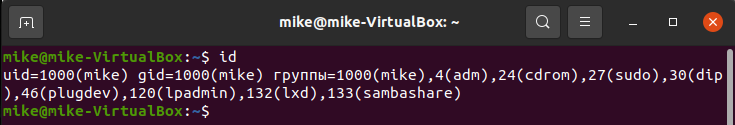

+ The "/etc/passwd" file is a text file with one record per line, each describing a user account. Each record consists of seven fields separated by colons.
+ The "/etc/group" file contains basic group attributes.

Information about user "mike" in "passwd":
+ username - mike.
+ password - x.
+ userID (UID) - 1000.
+ groupID (GID) - 1000.
+ uid comments (GEKOS) - Mike, 1, 1234567890, 0987654321, etc.
+ user home directory - /home/mike.
+ shell - /bin/bash.

Information about group "adm" in "group":
+ group name - adm.
+ password - x.
+ groupID (GID) - 4.
+ group list - syslog, mike.

Pseudo-users are used to grant privileges to system and software services (bin, adm, sshd, syslog). Their UIDs are usually between 1 and 999.


<p align="center"><b>2</b></p>

```
id
```


+ "id" - prints user and group information for the specified USER, or (when USER omitted) for the current user.

A UID is a unique identification number assigned to every user present in a Linux system. The primary role of the UID number is to identify the user to the Linux kernel. It is used to manage the system resources that a user has access to in the system. This is usually a positive number, not more than 65535. UID ranges:
+ 0 - root.
+ 1-999 - daemons, pseudo users, system and reserved users.
+ 1000-65533 - general users.
+ 65534 - "nobody", an account with no rights or permissions.


<p align="center"><b>3</b></p>

```
cat /etc/login.defs
```

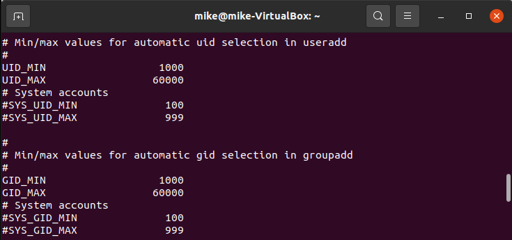

+ "/etc/login.defs" - configuration control definitions for the login package.

Ranges in each system may differ.

A GID is a unique identifier of the group within the system. GID ranges:
+ 0 - root group.
+ 0-99 - for statically allocated groups.
+ 100-999 - for groups dynamically allocated by the system in post-installation scripts.
+ 1000-60000 - user's groups.


<p align="center"><b>4</b></p>

```
cat /etc/group | grep mike
groups mike
```

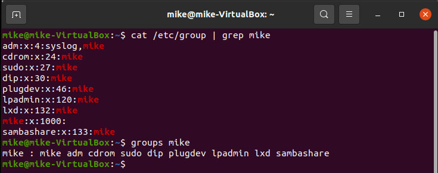

+ "groups" - prints the groups a user is in.


<p align="center"><b>5</b></p>

```
sudo adduser kate
```

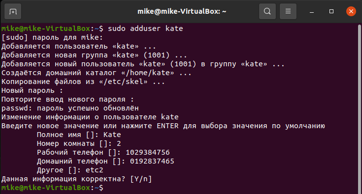

+ "adduser" - adds a user to the system.
+ "addgroup" - adds a group to the system.

The "adduser" command is a modified version of "useradd".

The basic parameters required to create a user: username, password, user info.


<p align="center"><b>6</b></p>

```
sudo usermod -l kylie kate
finger kylie
```

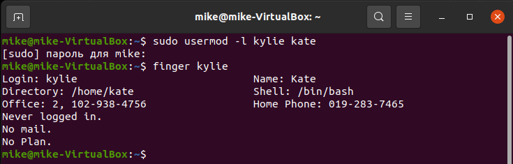

+ "usermod" - changes user account.


<p align="center"><b>7</b></p>

```
ls -alh /etc/skel/
cat /etc/default/useradd
```

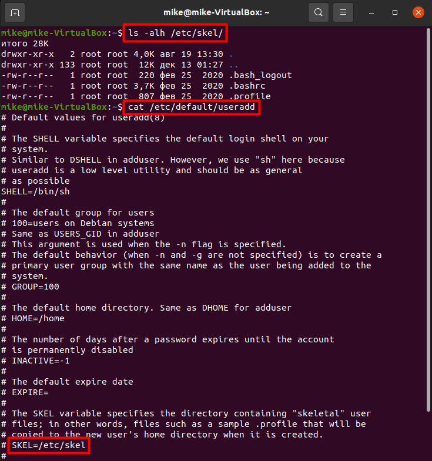

Directory "/etc/skel/" (skel is derived from the “skeleton”) is used to initiate home directory when a user is first created. “skeleton” directory is defined in "/etc/default/useradd" file.


<p align="center"><b>8</b></p>

```
sudo userdel -r kylie
```

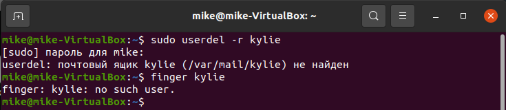

+ "userdel -r" - deletes user account and files.


<p align="center"><b>9</b></p>

```
sudo cat /etc/shadow | grep jane
sudo passwd -l jane
sudo passwd -u jane
sudo usermod -L jane
sudo cat /etc/shadow | grep jane
sudo usermod -U jane
sudo cat /etc/shadow | grep jane
```

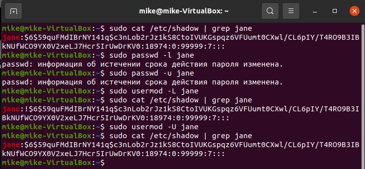

+ "passwd -l" and "usermod -L" - lock a user account.
+ "passwd -u" and "usermod -U" - unlock a user account.

If you lock a user account, the "/etc/shadow" file contains an exclamation (!) sign after the username.


<p align="center"><b>10</b></p>

```
sudo passwd -de jane
su jane
whoami
```

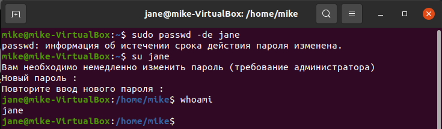


<p align="center"><b>11</b></p>

```
ls -alh
```

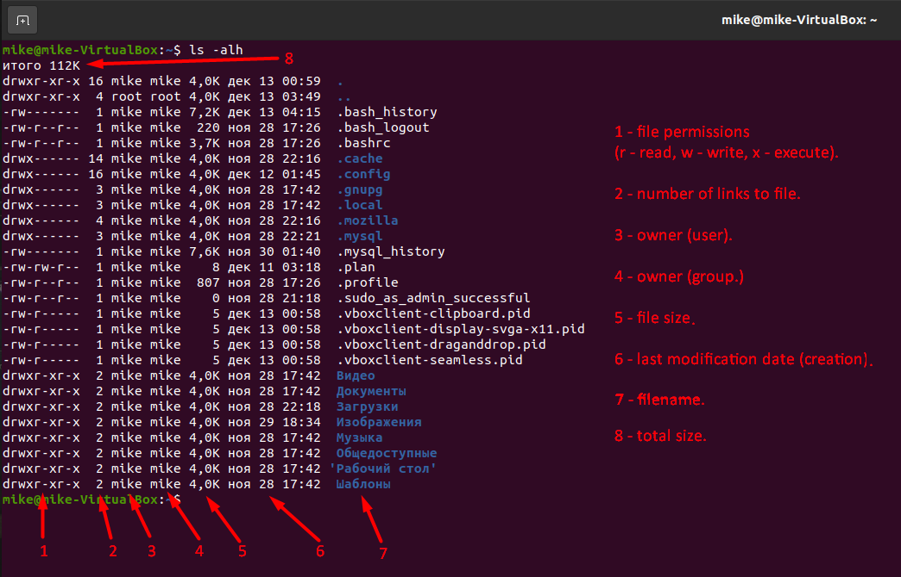


<p align="center"><b>12</b></p>

```
ls -alh
```

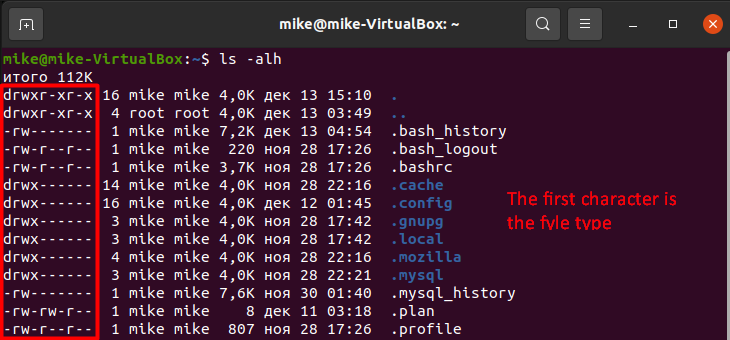

All files in Linux have their own permissions. There are existing 3 access rights for 3 roles. For each role, for each file, permissions are configured separately.

Access rights:
+ read (r) - read a file or list a directory's contents.
+ write (w) - write to a file or directory.
+ execute (x) - execute a file or recurse a directory tree.

Roles:
+ user (u) - file owner.
+ group (g) - members of the file's group.
+ other (o) - users who are neither the file's owner nor members of the file's group.


<p align="center"><b>13</b></p>

```
touch permissions
ls -alh | grep permissions
```

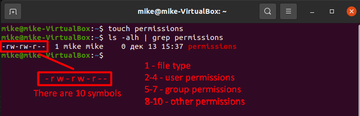

t r1 w1 x1 r2 w2 x2 r3 w3 x3, where:
+ t - file type.
+ r - read.
+ w - write.
+ x - execute.
+ 1 - user.
+ 2 - group.
+ 3 - other.


<p align="center"><b>14</b></p>

```
touch mikefile.txt
ls -lh | grep mikefile.txt
sudo chmod 777 mikefile.txt
ls -lh | grep mikefile.txt
sudo chown jane mikefile.txt
ls -lh | grep mikefile.txt
```

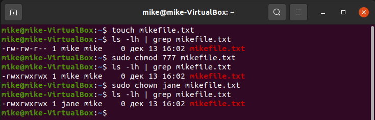

+ "chmod" - changes file mode bits.
+ "chown" - changes file owner and group.


<p align="center"><b>15</b></p>

```
umask -p
touch file1
ls -lh | grep file
umask 0337
umask -p
touch file2
ls -lh | grep file
```

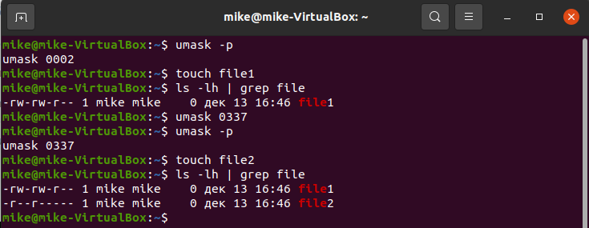

"umask" is a command that determines the settings of a mask that controls how file permissions are set for newly created files. For example:
+ umask - 0337. The first digit doesn't affect anything and is a holdover from the C syntax.
+ maximum permissions - 777.
+ permissions for a new file - 777-337= 440 - r--r-----.

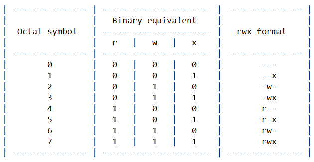


<p align="center"><b>16</b></p>

```
mkdir p16no
touch ./p16no/stickno
chmod 777 p16no
mkdir p16yes
touch ./p16yes/stickyes
chmod 1777 p16yes
ls -alh ./p16no/
ls -alh ./p16yes/
su jane
rm ./p16no/stickno
rm ./p16yes/stickyes
ls -alh ./p16no/
ls -alh ./p16yes/
```

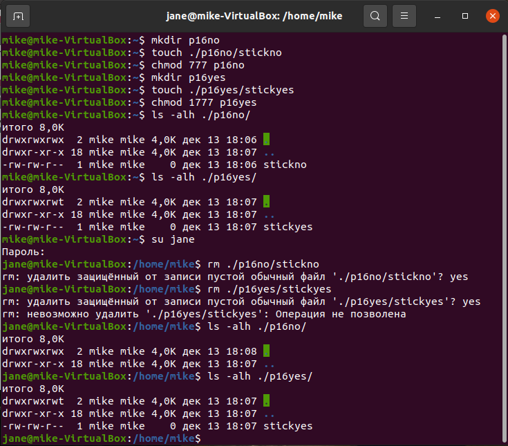

Sticky bit is mainly used on folders to avoid the deletion of a folder and its content by other users. When sticky bit is set on a directory, files in that directory may only be unlinked or renamed by root or the directory owner or the file owner. The Linux kernel ignores the sticky bit on files.

+ We can set sticky bit, for example, this way: "chmod 1777".


<p align="center"><b>17</b></p>

```
sudo chattr +a +A p16no
lsattr -a
```

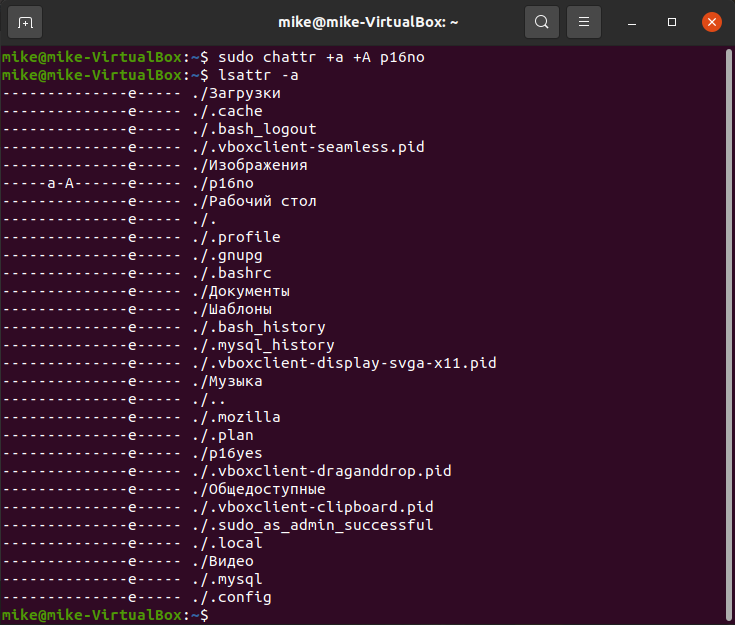

+ "lsattr" - lists file attributes on a Linux second extended file system.
+ "chattr" - changes file attributes on a Linux file system.

Command scripts must have execution permission to work.

The files and directories can have following attributes:
+ a - append only.
+ c - compressed.
+ d - no dump.
+ e - extent format.
+ i - immutable.
+ j - data journaling.
+ s - secure deletion.
+ t - no tail-merging.
+ u - undeletable.
+ A - no atime updates.
+ D - synchronous directory updates.
+ S - synchronous updates.
+ T - top of directory hierarchy.

