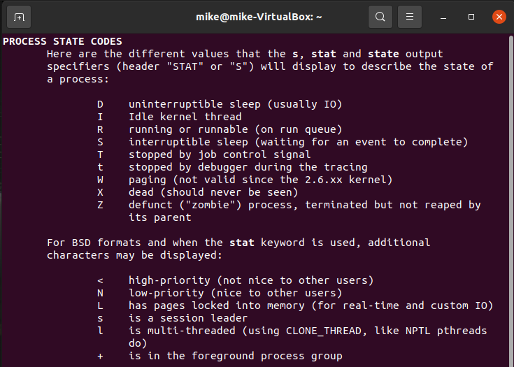
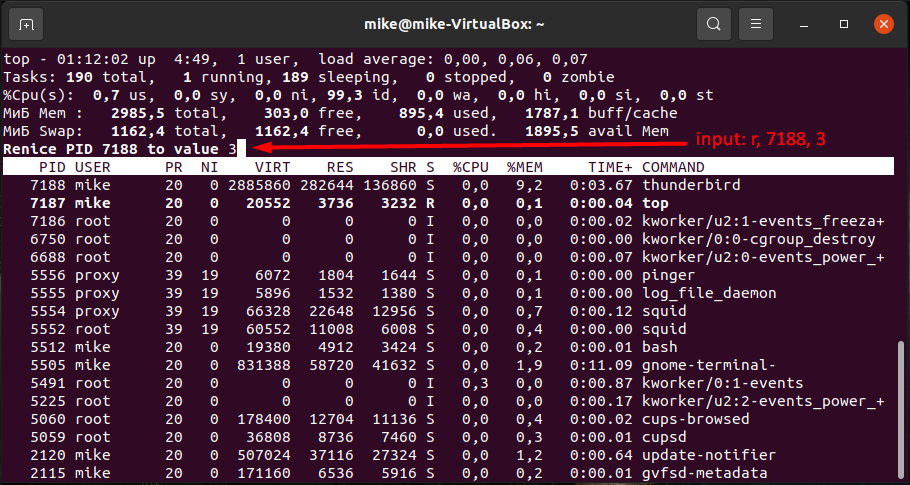

# Task 5.3

## Part 1

<p align="center"><b>1</b></p>

```
man ps
ps aux
```




In Linux, a process is an instance of executing a program or command. There are 5 possible states:
+ Running or Runnable (R).
+ Uninterruptible Sleep (D).
+ Interruptable Sleep (S).
+ Stopped (T).
+ Zombie (Z).


<p align="center"><b>2</b></p>

```
pstree
```


+ "pstree" - displays a tree of processes.


<p align="center"><b>3</b></p>

```
ps a
ls /proc/
```


The proc file system (procfs) is a virtual file system created on the fly when the system boots and is dissolved when the system shuts down. It can be used to obtain information about the system and to change certain kernel parameters at runtime (sysctl).


<p align="center"><b>4</b></p>

```
cat /proc/cpuinfo
```


<p align="center"><b>5</b></p>

```
su jane
links -width 500 -language english
ps au | grep jane
ps -o user,pid,args,group --pid 4207
```


<p align="center"><b>6</b></p>

```
ps --pid 2 --ppid 2 -o user,pid,ppid,args | head -n 10
ps --pid 2 --ppid 2 -o user,pid,ppid,args --deselect | head -n 10
```


Kernel processes are created by "kthread" (PID = 2).

+ PID - Process ID.
+ PPID - Parent Process ID.


<p align="center"><b>7</b></p>

```
ps -A -o user,pid,ppid,args,s | more
```


<p align="center"><b>8</b></p>

```
ps -o user,pid,ppid,args -u avahi
```


<p align="center"><b>9</b></p>

```
man ps
ps -o user,pid -u avahi
pgrep avahi
```


+ "pgrep" - looks up processes based on name and other attributes.


<p align="center"><b>10</b></p>

```
man top
top
```


The "top" program provides a dynamic real-time view of a running system.


<p align="center"><b>11</b></p>

```
top -u mike
```


<p align="center"><b>12</b></p>

```
top
```


Some interactive commands to control the "top" command:
+ Press "P" to sort the process list by CPU usage.
+ Press "N" to sort the list by PID.
+ Press "T" to sort by the running time.
+ Press "R" to reverse the sorting order.
+ Press "c" to display full command path and arguments of process.
+ Press "V" to display the processes in a parent-child hierarchy.
+ Press "h" to display help menu.


<p align="center"><b>13</b></p>

```
top
```


+ Press "F" to enter the interactive menu.
I sorted by name.


<p align="center"><b>14</b></p>

```
top
nice -n 17 thunderbird
sudo renice -n 7 -p 6997
```


Priority determines how much CPU time each process gets. Niceness values range from -20 (most favorable to the process) to 19 (least favorable to the process). There are 2 commands for changing priority:
+ "nice" - runs a program with modified scheduling priority.
+ "renice" - alters the priority of running processes.


<p align="center"><b>15</b></p>

```
top
r
7188
[enter]
3
[enter]
```




<p align="center"><b>16</b></p>

```
kill -L
thunderbird
ps a -o user,pid,args,s | grep thunderbird
kill -s 19 7383
ps a -o user,pid,args,s | grep thunderbird
kill -s 18 7383
ps a -o user,pid,args,s | grep thunderbird
```


The "kill" command sends a signal to a process. Examples of signals:
+ SIGTERM (15) - requests the termination of the process.
+ SIGKILL (9) - causes the process to terminate immediately.
+ SIGSTOP (19) - pauses the process in its current state.
+ SIGCONT (18) - resumes process execution.


<p align="center"><b>17</b></p>

```
thunderbird
[^Z]
jobs
bg
jobs
fg
[^C]
```


+ "jobs" - lists processes.
+ "bg" - puts suspended process into background.
+ "bg" - brings process into foreground.
+ "nohup" - runs a command immune to hangups, with output to a non-tty.


## Part 2

<p align="center"><b>1</b></p>

```
sudo apt install openssh-server
sudo nano /etc/ssh/sshd_config

ssh-keygen -t rsa
scp C:\Users\Mike\.ssh\id_rsa.pub mike@192.168.0.113
ssh mike@192.168.0.113
```


The most frequently used OpenSSH commands in the MS:
+ "ssh user@host" - connects to a remote host via SSH.
+ "ssh-keygen" - generates authorization key pair.


<p align="center"><b>2</b></p>

```
sudo nano /etc/ssh/sshd_config
```


It is possible to increase the basic security of the client-server connection by editing "sshd_config". For example:
+ "Port 222" - change port.
+ "Protocol 2" - enable SSH2.
+ "DenyUser Jake374 John01" - add blacklist.
+ "PermitRootLogin no" - disable root SSH login.
+ "ListenAddress 192.168.1.2" - allow SSH connection only from one IP address.


<p align="center"><b>3</b></p>

```
man ssh-keygen
sudo ssh-keygen -t dsa
sudo ssh-keygen -t ecdsa
sudo ssh-keygen -t rsa
sudo ls -alh /root/.ssh/
```


<p align="center"><b>4</b></p>


<p align="center"><b>5</b></p>


We can see that SSH packets are encrypted, unlike telnet packets.

