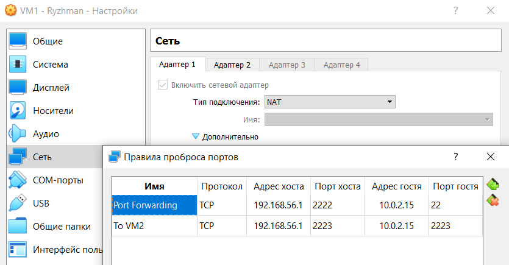
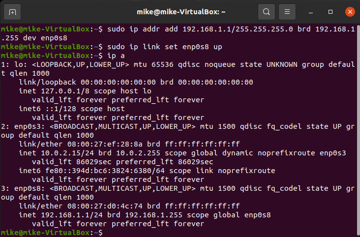
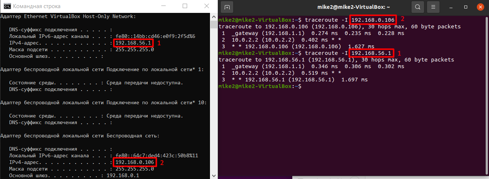
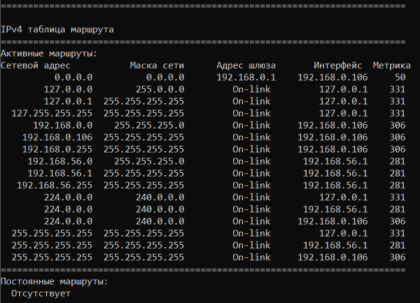

# Task 6.1

<p align="center"><b>1</b></p>

Firstly, I created 2 virtual machines (Ubuntu 20.04) and united them into a working group "MyNetwork". VM1 has 2 network adapters: NAT and Internal. VM2 has only Internal. The internal network is called "MyIntnet". After this, I configured port forwarding from HOST to VM1 NAT. 
Rule 1 - "Port Forwarding":
+ Protocol - TCP.
+ Host address - 192.168.56.1.
+ Host port - 2222.
+ Guest address - 10.0.2.15.
+ Guest port - 22.

Rule 2 - "To VM2":
+ Protocol - TCP.
+ Host address - 192.168.56.1.
+ Host port - 2223.
+ Guest address - 10.0.2.15.
+ Guest port - 2223.

According to the scheme in this task, VM2 speaks with the Internet via VM1.





<p align="center"><b>2</b></p>
<p align="center"><b>VM1</b></p>

I set the IP address, made port forwarding from VM1 to VM2, and configured iptables for this virtual machine.

```
sudo ip addr add 192.168.1.1/255.255.255.0 brd 192.168.1.255 dev enp0s8
sudo ip link set enp0s8 up
ip a

sudo su
sudo echo "192.168.1.2 VM2" >> /etc/hosts
sudo echo "net.ipv4.ip_forward = 1" >> /etc/sysctl.conf
sudo sysctl -p
sudo cat /proc/sys/net/ipv4/ip_forward

sudo iptables -t nat -A POSTROUTING -o enp0s3 -j MASQUERADE
sudo iptables -t nat -A PREROUTING -i enp0s3 -p tcp --dport 2223 -j DNAT --to-destination 192.168.1.2:22
sudo iptables -A FORWARD -p tcp -d 192.168.1.2 --dport 22 -m state --state NEW,ESTABLISHED,RELATED -j ACCEPT
ip route

sudo su
mkdir /etc/iptables-conf/
iptables-save > /etc/iptables-conf/iptables_rules2.ipv4
iptables-restore /etc/iptables-conf/iptables_rules.ipv4
```




<p align="center"><b>VM2</b></p>

I edited the "/etc/netplan/01-network-manager-all.yaml" file to configure the network in this virtual machine. I set IP address, default gateway, and DNS-resolvers.

```
sudo nano /etc/netplan/01-network-manager-all.yaml
sudo netplan try
sudo netplan apply
ip a
```

```yaml
# Let NetworkManager manage all devices on this system
network:
  version: 2
  renderer: NetworkManager
  ethernets:
    enp0s3:
      dhcp4: no
      addresses:
        - 192.168.1.2/24
      gateway4: 192.168.1.1
      nameservers:
        addresses: [8.8.8.8, 8.8.4.4]
```


<p align="center"><b>3</b></p>

```
sudo apt install traceroute
traceroute -I 192.168.0.106
traceroute -I 192.168.56.1
```



+ "traceroute" - prints the route packets trace to network host.


<p align="center"><b>4</b></p>

```
ping -c 4  8.8.8.8
```


<p align="center"><b>5</b></p>

```
nslookup 8.8.8.8
```


+ "nslookup" - is a program to query Internet domain name servers.


<p align="center"><b>6</b></p>

```
nslookup epam.com
```


<p align="center"><b>7</b></p>

```
ipconfig
route print

ip route
```





<p align="center"><b>8</b></p>

```
traceroute - I google.com
```


<p align="center"><b>extra</b></p>

```
ssh -p 2222 mike@192.168.56.1
ssh -p 2223 mike2@192.168.56.1
```


