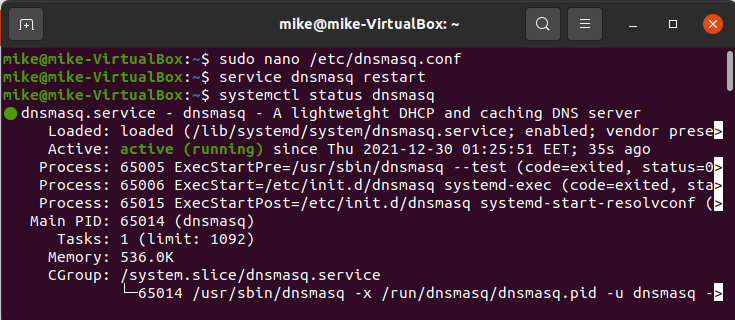
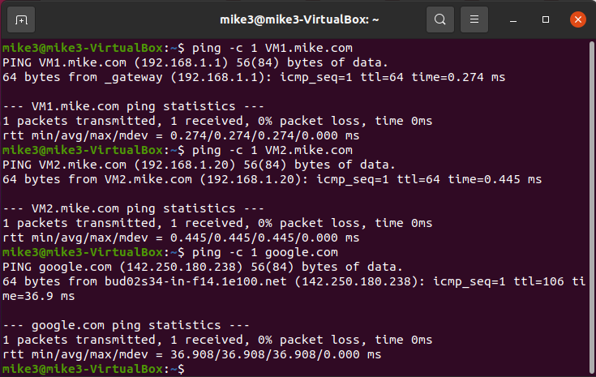
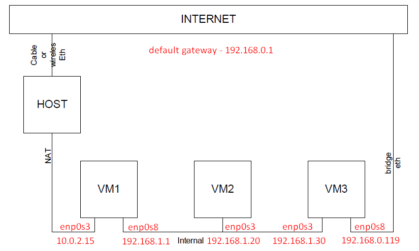

# Task 6.2

<p align="center"><b>1</b></p>


<p align="center"><b>2</b></p>

<p align="center"><b>DNSMASQ</b></p>

```
sudo apt install dnsmasq

sudo mkdir /var/lib/dnsmasq/
sudo touch /var/lib/dnsmasq/dnsmasq.leases
sudo nano /etc/dnsmasq.conf

[
domain=mike.com
interface=enp0s8
dhcp-range=192.168.1.2,192.168.1.100,12h
dhcp-option=1,255.255.255.0
dhcp-option=3,192.168.1.1
dhcp-host=08:00:27:10:08:F6,VM2,192.168.1.20
dhcp-host=08:00:27:02:B7:36,VM3,192.168.1.30
dhcp-leasefile=/var/lib/dnsmasq/dnsmasq.leases
dhcp-authoritative
]

sudo systemctl disable systemd-resolved
sudo systemctl mask systemd-resolved
sudo systemctl stop systemd-resolved
sudo systemctl start dnsmasq
sudo systemctl status dnsmasq

sudo iptables -t nat -A PREROUTING -i enp0s3 -p tcp --dport 2223 -j DNAT --to-destination 192.168.1.20:22
sudo iptables -A FORWARD -p tcp -d 192.168.1.20 --dport 22 -m state --state NEW,ESTABLISHED,RELATED -j ACCEPT
sudo iptables -t nat -A PREROUTING -i enp0s3 -p tcp --dport 2224 -j DNAT --to-destination 192.168.1.30:22
sudo iptables -A FORWARD -p tcp -d 192.168.1.30 --dport 22 -m state --state NEW,ESTABLISHED,RELATED -j ACCEPT
sudo iptables -t filter -L
sudo iptables -t nat -L
```


<p align="center"><b>VBoxManage</b></p>

```
VBoxManage dhcpserver add --netname MyIntnet --ip 192.168.1.1 --netmask 255.255.255.0 --lowerip 192.168.1.2 --upperip 192.168.1.100 --enable
VBoxManage dhcpserver remove --netname MyIntnet
```


+ VirtualBox will automatically start a DHCP server for virtual networks when the first virtual machine starts using these networks.


<p align="center"><b>3</b></p>

<p align="center"><b>VM2 + VM3</b></p>

```
sudo nano /etc/netplan/01-network-manager-all.yaml

[
network:
  version: 2
  renderer: NetworkManager
  ethernets:
    enp0s3:
      dhcp4: true
      dhcp6: no
]

sudo netplan try
sudo netplan apply
ip a
```


<p align="center"><b>VM1</b></p>

```
sudo nano /etc/hosts

[
192.168.1.1 VM1
192.168.1.20 VM2
192.168.1.30 VM3
]

grep "VM" /etc/hosts
```


<p align="center"><b>4</b></p>

```
sudo nano /etc/dnsmasq.conf

[
listen-address=192.168.1.1
no-hosts
address=/VM1.mike.com/192.168.1.1
address=/VM2/192.168.1.20
address=/VM3/192.168.1.30
server=8.8.8.8
server=8.8.4.4
port=53
]

service dnsmasq restart
systemctl status dnsmasq
```




After this configuration, I have gotten access to the Internet.


<p align="center"><b>5</b></p>

<p align="center"><b>VM2</b></p>

```
ping -c 1 VM1.mike.com
ping -c 1 VM3.mike.com
ping -c 1 google.com
```


<p align="center"><b>VM3</b></p>

```
ping -c 1 VM1.mike.com
ping -c 1 VM2.mike.com
ping -c 1 google.com
```



<p align="center"><b>VM1</b></p>

```
ping -c 1 VM2.mike.com
ping -c 1 VM3.mike.com
ping -c 1 google.com
```


<p align="center"><b>VM2</b></p>

```
nmap -sP 192.168.1.0/24 | grep "report"
```


<p align="center"><b>6</b></p>


<p align="center"><b>VM1</b></p>

```
sudo apt install quagga
sudo touch /etc/quagga/zebra.conf
sudo nano /etc/quagga/zebra.conf

[
hostname VM1
password mike.com
enable password mike.com
log file /var/log/quagga/zebra.log
!
line vty
!
]

sudo touch /etc/quagga/ospfd.conf
sudo nano /etc/quagga/ospfd.conf

[
log file /var/log/quagga/ospfd.log
router ospf
  ospf router-id 192.168.1.1
  log-adjacency-changes
  redistribute kernel
  redistribute connected
  redistribute static
  network 192.168.1.0/24 area 1
!
access-list 20 permit 192.168.1.0 0.0.0.255
access-list 20 deny any
!
line vty
!
]

sudo chown quagga:quagga /etc/quagga/*.conf
sudo mkdir /var/log/quagga/
sudo chown quagga:quagga /var/log/quagga/

sudo service zebra restart
sudo service ospfd restart
sudo service zebra status
sudo service ospfd status
```


<p align="center"><b>VM2</b></p>

```
sudo apt install quagga
sudo touch /etc/quagga/zebra.conf
sudo nano /etc/quagga/zebra.conf

[
hostname VM2
password mike.com
enable password mike.com
log file /var/log/quagga/zebra.log
!
line vty
!
]

sudo touch /etc/quagga/ospfd.conf
sudo nano /etc/quagga/ospfd.conf

log file /var/log/quagga/ospfd.log
router ospf
  ospf router-id 192.168.1.20
  log-adjacency-changes
  redistribute kernel
  redistribute connected
  redistribute static
  network 192.168.1.0/24 area 1
!
access-list 20 permit 192.168.1.0 0.0.0.255
access-list 20 deny any
!
line vty
!
]

sudo chown quagga:quagga /etc/quagga/*.conf
sudo mkdir /var/log/quagga/
sudo chown quagga:quagga /var/log/quagga/

sudo service zebra restart
sudo service ospfd restart
sudo service zebra status
sudo service ospfd status
```

<p align="center"><b>VM3</b></p>

```
sudo apt install quagga
sudo touch /etc/quagga/zebra.conf
sudo nano /etc/quagga/zebra.conf

[
hostname VM3
password mike.com
enable password mike.com
log file /var/log/quagga/zebra.log
!
line vty
!
]

sudo touch /etc/quagga/ospfd.conf
sudo nano /etc/quagga/ospfd.conf

[
log file /var/log/quagga/ospfd.log
router ospf
  ospf router-id 192.168.1.30
  log-adjacency-changes
  redistribute kernel
  redistribute connected
  redistribute static
  network 192.168.1.0/24 area 1
  network 192.168.0.0/24 area 0.0.0.0
!
access-list 20 permit 192.168.1.0 0.0.0.255
access-list 20 permit 192.168.0.0 0.0.0.255
access-list 20 deny any
!
line vty
!
]

sudo chown quagga:quagga /etc/quagga/*.conf
sudo mkdir /var/log/quagga/
sudo chown quagga:quagga /var/log/quagga/

sudo service zebra restart
sudo service ospfd restart
sudo service zebra status
sudo service ospfd status
```


<p align="center"><b>7</b></p>

<p align="center"><b>VM1</b></p>

```
sudo tcpdump -nvi any proto ospf

ip route
route -n
```


<p align="center"><b>VM2</b></p>

```
sudo ip route add 192.168.5.4 dev enp0s3
ip route
route -n
```


<p align="center"><b>VM1</b></p>

```
ip route
route -n
```


<p align="center"><b>VM3</b></p>

```
ip route
route -n
```


<p align="center"><b>HOST</b></p>



```
ssh -p 2224 mike3@192.168.56.1
```


