# Task 7.1

## Part A

```bash
#!/bin/bash

description () {
    echo -e "\nThis script is designed to check network host/port availability.\n\nNote! You must install Nmap to use this script (sudo apt install nmap)."
    echo -e "\nSynopsis:"
    echo "    netscan --option <target>"
    echo -e "\nThere are 3 possible keys:"
    echo "    --all - to display available network hosts in a certain subnet."
    echo "    --target - to display available network ports on a certain host."
    echo "    --help - to display help menu."
    echo -e "\nExamples:"
    echo -e "    netscan --all 192.168.1.0/24\n        - to display available network hosts in the 192.168.1.0/24 subnet."
    echo -e "    netscan --target 192.168.1.1\n        - to display available network ports on the target host.\n"
}

netscan () {
    target=$1
    nmapcheck="/usr/bin/nmap"
    
    if [ -e "$nmapcheck" ]
        then nmap -sP $target | grep report | awk ' {print $5,$6} '
    else
        echo -e "\nERROR! You must install Nmap to use this script (sudo apt install nmap).\n"
    fi
}

portscan () {
    target=$1
    nmapcheck="/usr/bin/nmap"
    
    if [ -e "$nmapcheck" ]
        then nmap $target | grep open
    else
        echo -e "\nERROR! You must install Nmap to use this script (sudo apt install nmap).\n"
    fi
}

if [ "$#" == 0 ]
    then description
elif [ "$1" == "--all" ]
    then netscan $2
elif [ "$1" == "--target" ]
    then portscan $2
elif [ "$1" == "--help" ]
    then description
else
    echo -e "\nERROR! You need to read the help menu more carefully."; description
fi
```
Create a script that uses the following keys:
1. When starting without parameters, it will display a list of possible keys and their description.

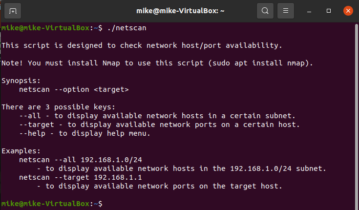

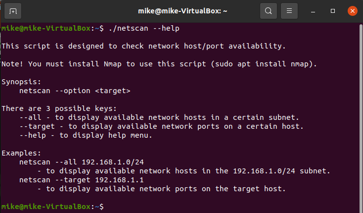

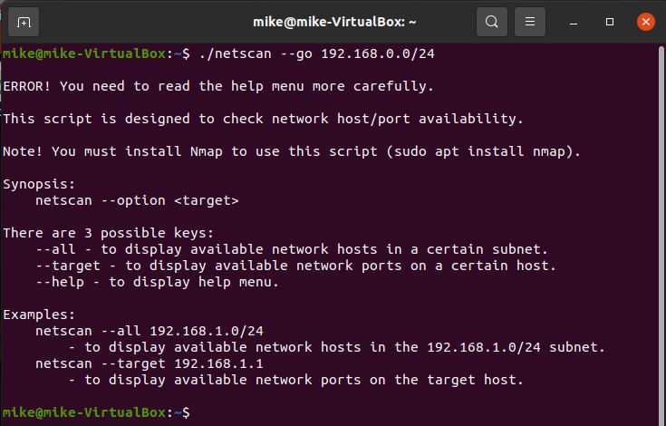

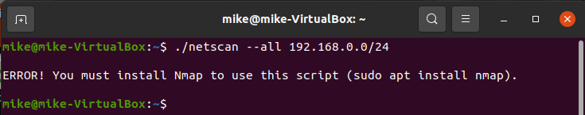

2. The --all key displays the IP addresses and symbolic names of all hosts in the current subnet.

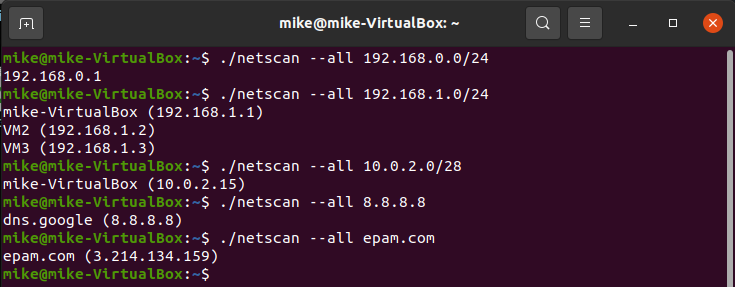

3. The --target key displays a list of open system TCP ports.

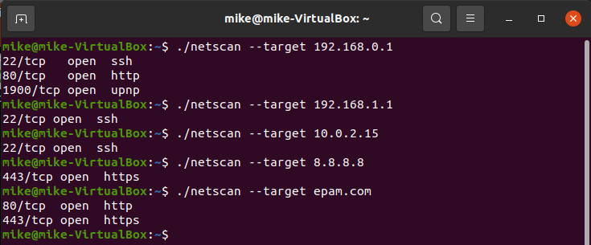


## Part B

```bash
#!/bin/bash

description () {
    echo -e "\nThis script is designed to scan Apache logs."
    echo -e "\nSynopsis:"
    echo "    logscan -option <file>"
    echo -e "\nThere are 7 possible keys that give answers to different questions:"
    echo "    -1 - From which IP were the most requests?"
    echo "    -2 - What is the most requested page?"
    echo "    -3 - How many requests were there from each IP?"
    echo "    -4 - What non-existent pages were clients referred to?"
    echo "    -5 - What time did the site get the most requests (hour)?"
    echo "    -6 - What search bots have accessed the site (UA + IP)?"
    echo "    -h - to display help menu."
    echo -e "\nExamples:"
    echo -e "    logscan -3 /home/mike/apache_logs.txt\n        - to scan log with key number 3."
    echo -e "    logscan -5 /home/mike/apache/apache1.log\n        - to scan log with key number 5.\n"
}

one () {
    echo "From which IP were the most requests?"
    target=$1
    awk '{ print $1 }' $target | sort | uniq -c | sort -n | tail -n 1 | awk '{ print $2 }'
}

two () {
    echo "What is the most requested page?"
    target=$1
    awk '{ print $7 }' $target | sort | uniq -c | sort -n | tail -n 1 | awk '{ print $2 }'
}

three () {
    echo "How many requests were there from each IP?"
    target=$1
    awk '{ print $1 }' $target | sort | uniq -c | sort -nr
}

four () {
    echo "What non-existent pages were clients referred to?"
    target=$1
    grep "error404\| 404 " $target | awk '{ print $7 }' | sort | uniq -c | sort -nr | awk '{ print $2 }'
}

five () {
    echo "What time did the site get the most requests (hour)?"
    target=$1
    awk '{ print $4 }' $target | sed 's/:/\t/g' | awk '{ print $2 }' | sort | uniq -c | sort -n | tail -n 1 | awk '{ print $2 }'
}

six () {
    echo "What search bots have accessed the site (UA + IP)?"
    target=$1
    awk '{for (i=1;i<=NF;i++){if ($i~/bot/ || $i~/Bot/){print $1,$i}}}' $target | sort | uniq | grep -v "robots\|robot\|botoks\|boteksa\|SBotJ"
    #grep -oi "\w*bot\w*" $target | sort | uniq
}

if [ "$#" == 0 ]
    then description
elif [ ! -e "$2" ] && [ ! -z "$2" ] && [ ! "$1" == "-h" ]
    then echo -e "\nERROR! This file or directory doesn't exist. You need to type the path more carefully.\n"
elif [ "$1" == "-1" ] && [ ! -z "$2" ]
    then one $2
elif [ "$1" == "-2" ] && [ ! -z "$2" ]
    then two $2
elif [ "$1" == "-3" ] && [ ! -z "$2" ]
    then three $2
elif [ "$1" == "-4" ] && [ ! -z "$2" ]
    then four $2
elif [ "$1" == "-5" ] && [ ! -z "$2" ]
    then five $2
elif [ "$1" == "-6" ] && [ ! -z "$2" ]
    then six $2
elif [ "$1" == "-h" ]
    then description
else
    echo -e "\nERROR! You need to read the help menu more carefully."; description
fi
```

Using Apache log example create a script to answer the following questions:

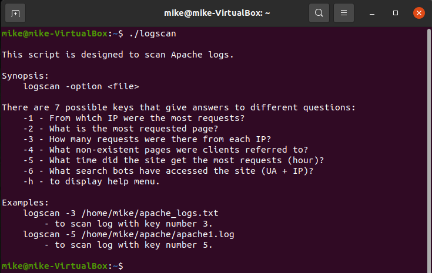

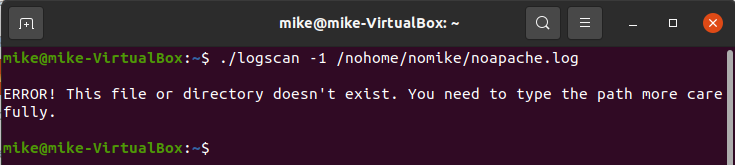

1. From which IP were the most requests?

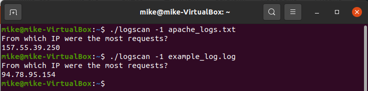

2. What is the most requested page?

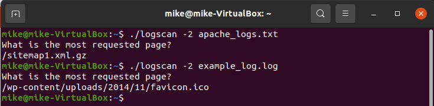

3. How many requests were there from each IP?

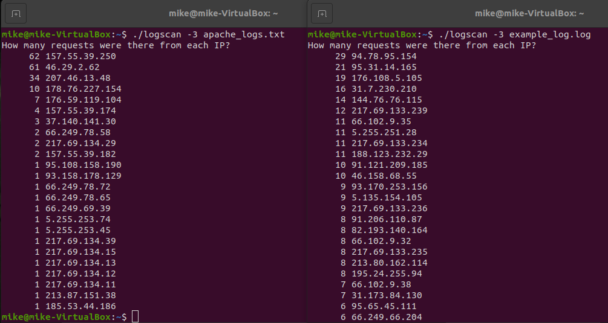

4. What non-existent pages were clients referred to?

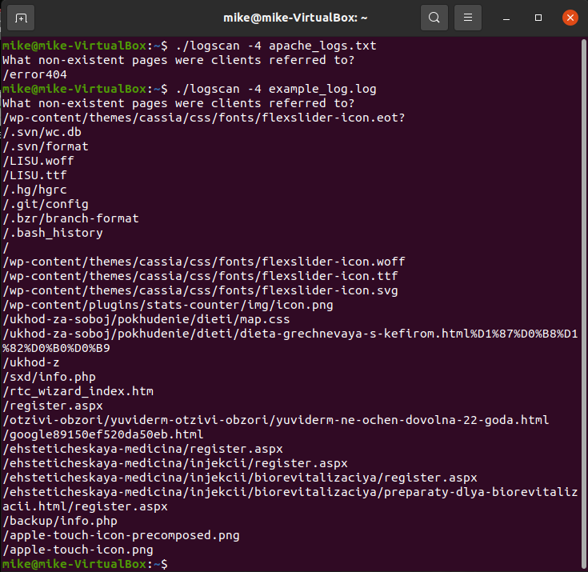

5. What time did site get the most requests?

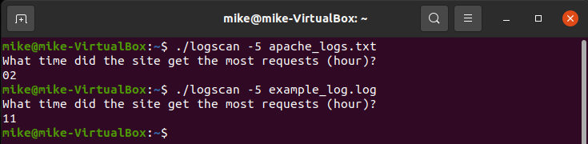

6. What search bots have accessed the site (UA + IP)?

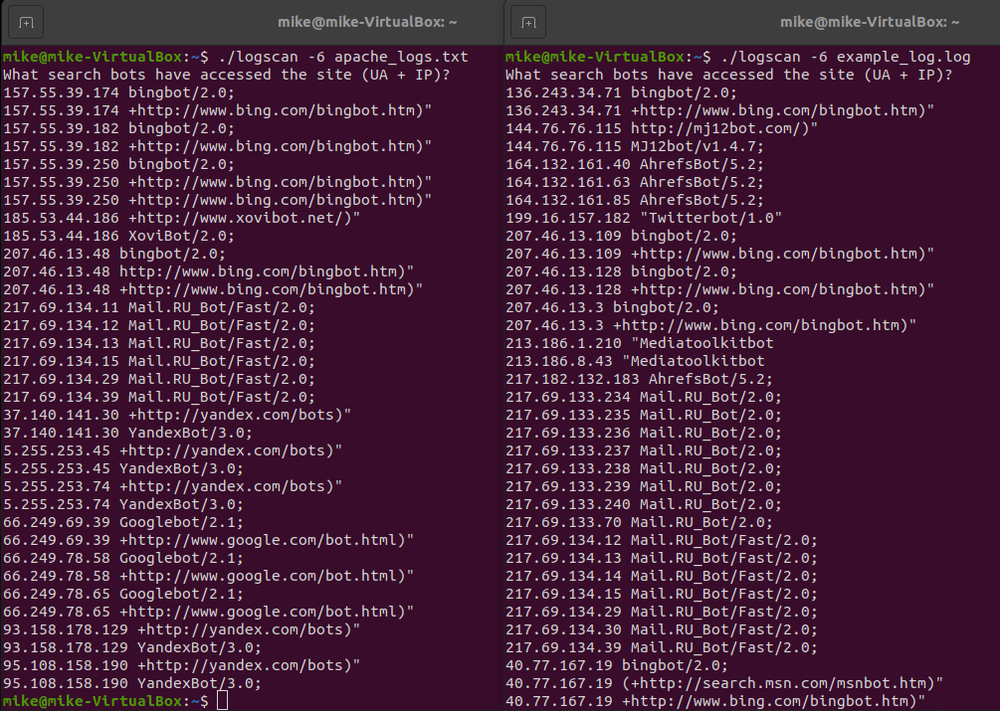


## Part C

```bash
#!/bin/bash

description () {
    echo -e "\nThis script is designed to make a backup from one directory to another."
    echo -e "\nSynopsis:"
    echo "    backup_d <path to source dir> <path to destination dir>"
    echo -e "\nExamples:"
    echo "    backup_d /home/mike/source/ /home/mike/destination/"
    echo -e "    backup_d -h\n"
}

backup () {
    src=$1
    dst=$2
    log=$dst"backup_d.log"
    temp_d=$dst".temp/"
    temp=$temp_d"temp"
    temp2=$temp_d"temp2"
    temp3=$temp_d"temp3"
    time=$(date "+[%d/%m/%Y-%H:%M:%S]")
    
    if [ ! -d $temp_d ]
        then mkdir $temp_d
    fi
    
    if [ ! -e $log ]
        then touch $log
    fi
    
    if [ ! -e $temp ]
        then touch $temp
    fi
    
    if [ ! -e $temp2 ]
        then touch $temp2
    fi
    
    if [ ! -e $temp3 ]
        then touch $temp3
    fi
    
    for file in `find $src -type f -name "*"`
        do echo $file
    done > $temp
    
    diff $temp $temp2 | grep "<" | awk -F"/" '{print $NF}' > $temp3
    while read line; do
    echo "$time Added $line" >> $log
    done < $temp3
    
    diff $temp $temp2 | grep ">" | awk -F"/" '{print $NF}' > $temp3
    while read line; do
    echo "$time Deleted $line" >> $log
    done < $temp3
    
    for file in `find $dst -type f -name "*"`
        do echo $file
    done > $temp3
    
    diff $temp $temp3 | grep "<" | awk '{print $2}' > $temp3
    while read line; do
    cp $line $dst
    done < $temp3
    
    cat $temp > $temp2
    
}

if [ "$#" == 0 ]
    then description
elif [ -d "$1" ] && [ -d "$2" ]
    then backup $1 $2
elif [ "$1" == "-h" ]
    then description
else
    echo -e "\nERROR! You need to read the help menu more carefully."; description
fi
```

Create a data backup script that takes the following data as parameters:
1. Path to the syncing directory.
2. The path to the directory where the copies of the files will be stored.
+ In case of adding new or deleting old files, the script must add a corresponding entry to the log file indicating the time, type of operation and file name. The command to run the script must be added to crontab with a run frequency of one minute.

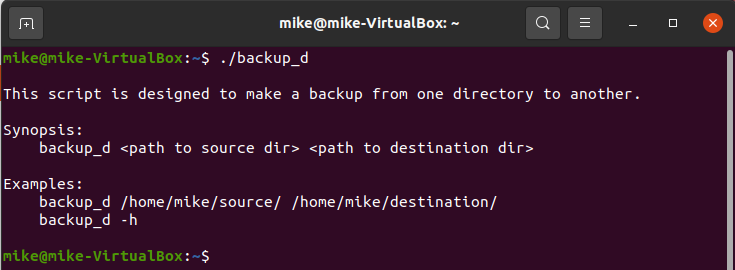

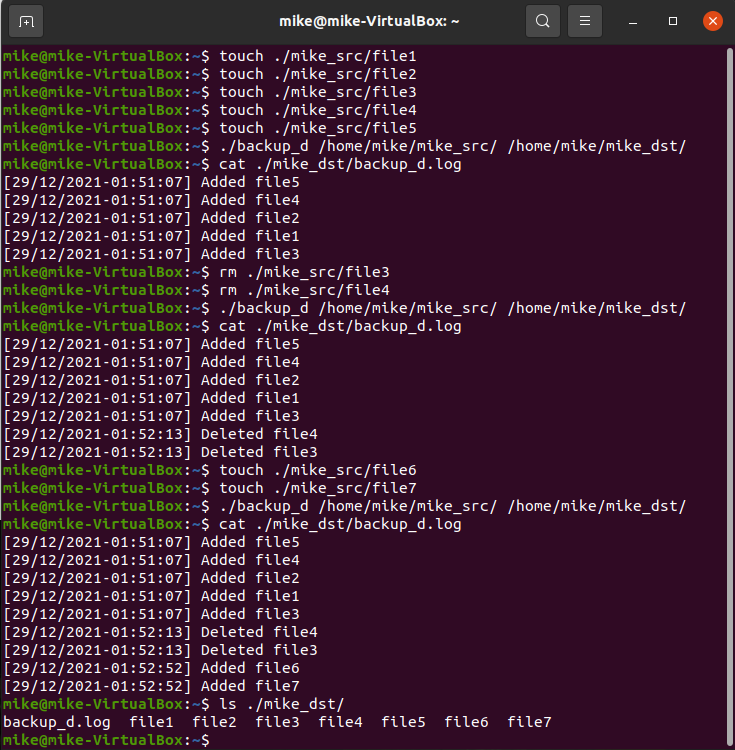

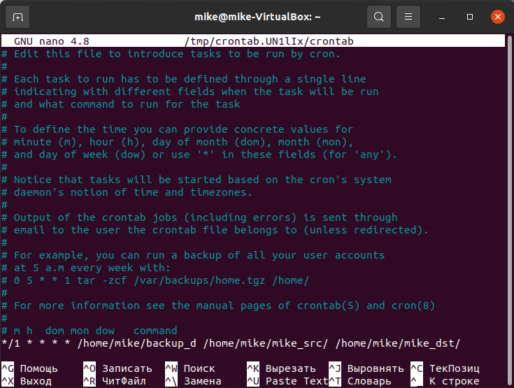

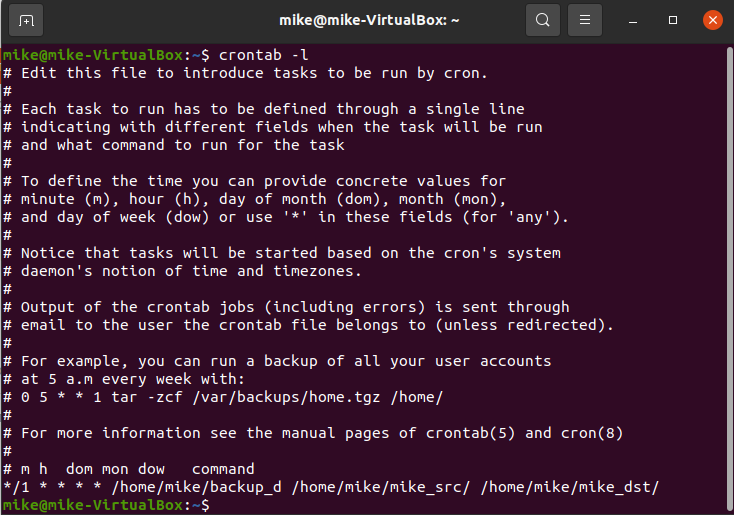

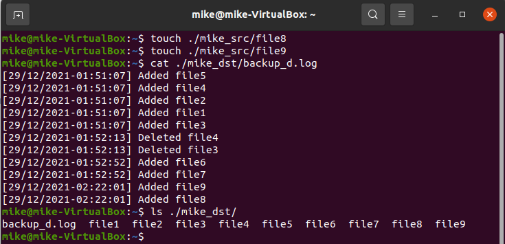

