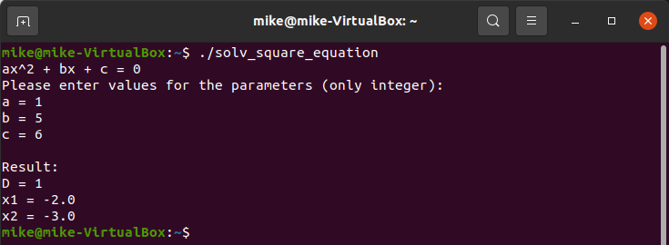

# Task 8.1

## solv_square_equation.py

```python

def validate_param():
    print("ax^2 + bx + c = 0\nPlease enter values for the parameters (only integer):")
    attempts = 3
    while attempts > 0:
        try:
            a = int(input("a = "))
            b = int(input("b = "))
            c = int(input("c = "))
        except ValueError:
            attempts -= 1
            print(f'\nThe value is not an integer.\nYou only have {attempts} attempt(s).\n')
        else:
            if a == 0:
                print("\nParameter a is 0. This is not a square equation.")
                quit()
            return a, b, c
    if attempts == 0:
        print("You have used all your attempts. Terminating the script...")
        quit()


def discriminant(a, b, c):
    return b ** 2 - 4 * a * c


def roots(d, a, b, c):
    if d > 0:
        x1 = (-b + d ** 0.5) / (2 * a)
        x2 = (-b - d ** 0.5) / (2 * a)
        return round(x1, 2), round(x2, 2)
    elif d == 0:
        x = -b / (2 * a)
        return round(x, 2), None
    else:
        return None, None


def solv_square(a, b, c) -> roots:
    d = discriminant(a, b, c)
    return roots(d, a, b, c)


def square_print(a, b, c, result):
    print("\nResult:")
    print(f'D = {discriminant(a, b, c)}')
    x1, x2 = result
    if x1 is None and x2 is None:
        print("The equation does not have any root.")
    elif x2 is None:
        print(f'x = {x1}')
    else:
        print(f'x1 = {x1}')
        print(f'x2 = {x2}')


def main():
    parameters = validate_param()
    a = parameters[0]
    b = parameters[1]
    c = parameters[2]
    result = solv_square(a, b, c)
    square_print(a, b, c, result)


if __name__ == "__main__":
    main()

```


<p align="center"><b>exit_code</b></p>

We can import "sys" and configure exit code. I added "sys.exit (100)" to finish the script with exit code 100 in case of an expected error.


## solv_square_equation_test.py

```python

import unittest
import solv_square_equation


class SquareEquationTests(unittest.TestCase):
    def test_discriminant(self):
        self.assertEqual(solv_square_equation.discriminant(1, 5, 6), 1)
        self.assertEqual(solv_square_equation.discriminant(1, 4, 8), -16)
        self.assertEqual(solv_square_equation.discriminant(2, 5, -7), 81)
        self.assertEqual(solv_square_equation.discriminant(16, -8, 1), 0)
        self.assertEqual(solv_square_equation.discriminant(1, -6, 9), 0)
        self.assertEqual(solv_square_equation.discriminant(1, -4, -5), 36)
        self.assertEqual(solv_square_equation.discriminant(1, 0, -3), 12)

    def test_roots(self):
        self.assertEqual(solv_square_equation.roots(1, 1, 5, 6), (-2.0, -3.0))
        self.assertEqual(solv_square_equation.roots(-16, 1, 4, 8), (None, None))
        self.assertEqual(solv_square_equation.roots(81, 2, 5, -7), (1.0, -3.5))
        self.assertEqual(solv_square_equation.roots(0, 16, -8, 1), (0.25, None))
        self.assertEqual(solv_square_equation.roots(0, 1, -6, 9), (3.0, None))
        self.assertEqual(solv_square_equation.roots(36, 1, -4, -5), (5.0, -1.0))
        self.assertEqual(solv_square_equation.roots(12, 1, 0, -3), (1.73, -1.73))

    def test_solv_square(self):
        self.assertEqual(solv_square_equation.solv_square(1, 5, 6), (-2.0, -3.0))
        self.assertEqual(solv_square_equation.solv_square(1, 4, 8), (None, None))
        self.assertEqual(solv_square_equation.solv_square(2, 5, -7), (1.0, -3.5))
        self.assertEqual(solv_square_equation.solv_square(16, -8, 1), (0.25, None))
        self.assertEqual(solv_square_equation.solv_square(1, -6, 9), (3.0, None))
        self.assertEqual(solv_square_equation.solv_square(1, -4, -5), (5.0, -1.0))
        self.assertEqual(solv_square_equation.solv_square(1, 0, -3), (1.73, -1.73))


if __name__ == '__main__':
    unittest.main()

```


## Linux

We can execute scripts, for example, in Linux CLI. One of the ways is to add a path to the interpreter before the script. I added "#!/usr/bin/python3".




I renamed the file to "solv_square_equation.py" to import it and run the test.


